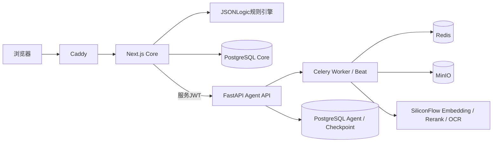

# 社保规划助手技术架构

> Author: Jan
> Status: Active
> Updated: 2026-09-01

## 系统定位

Socila是以确定性政策规则为核心的社保规划与政策运营系统。浏览器用户通过Next.js完成登录、对话、规划和管理操作；PolicyOps Agent在内部网络中处理公开政策的采集、解析、检索、影响分析和draft生成。

## 系统结构

## 组件职责

| 组件 | 职责 |
| --- | --- |
| Next.js Core | 浏览器入口、用户业务、认证、规则与发布、Agent草案导入 |
| 规则引擎 | 确定性计算plan、calc和trace |
| FastAPI | 内部Agent控制面和OpenAPI契约 |
| LangGraph | 可恢复工作流、Checkpoint、人工interrupt |
| Celery / Redis | 采集调度、异步解析、重试、死信和周期任务 |
| PostgreSQL | Core、Agent、Checkpoint、JSONB、全文和pgvector |
| MinIO | 原始政策、页面图像和解析资源 |
| SiliconFlow | 公开政策Embedding、Rerank和OCR |

## 核心边界

- 浏览器不直接访问FastAPI、PostgreSQL、Redis或MinIO。
- Next到FastAPI使用Docker内网和5分钟HS256服务JWT。
- Agent角色不能直接修改Core published数据。
- Agent只能在管理员批准后调用Core接口创建draft。
- 用户资料不得进入政策Embedding、Rerank和OCR数据流。
- published规则、参数和快照不可变。

## 当前部署

Personal Demo使用单机Docker Compose，包含proxy、web、agent、worker、beat、PostgreSQL、Redis和MinIO。生产事实源已经从Neon迁移到本地PostgreSQL；Neon不再承接运行时读写。

详细架构、测试和运维约束见[PolicyOps重构文档](./refactor/policy-ops-agent/README.md)。

## 历史说明

重构前架构已归档为[legacy-repository-architecture-2026-08.md](./refactor/policy-ops-agent/archive/legacy-repository-architecture-2026-08.md)，不再作为当前事实源。
