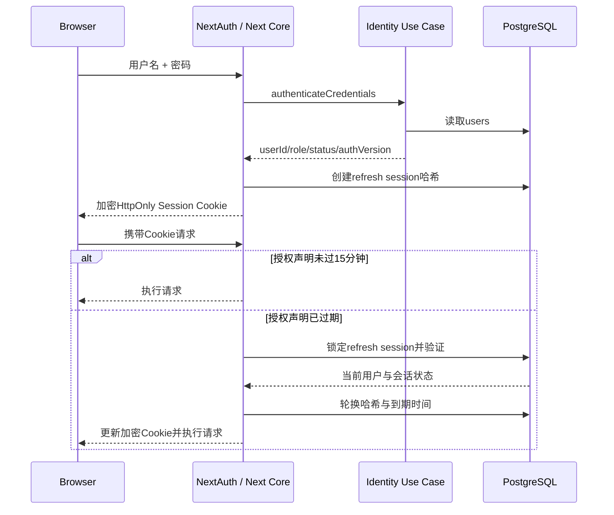

# 用户与管理员双角色登录注册鉴权 PRD

> Author: Jan
> Status: Active
> Updated: 2026-09-03

## 文档元数据

| 字段 | 值 |
| --- | --- |
| PRD文件 | `09-02-feature-user-admin-auth.md` |
| 类型 | Feature |
| 状态 | Active |
| 前置依赖 | Stage 02 Next.js Core、CORE-FR-009资源所有权、NextAuth v5 Credentials、PostgreSQL Core Schema |
| 可并行阶段 | 无；身份、会话、路由门禁和资源归属需按本PRD统一实施 |
| 后续消费者 | 用户规划与对话、管理后台、PolicyOps审核与发布 |
| 退出门禁 | 注册、登录、刷新会话、固定双角色鉴权、改密、管理员用户管理和所有权隔离全部取得新鲜验收证据 |
| 对应总体需求 | CORE-FR-005、CORE-FR-006、CORE-FR-009、CORE-AC-002、PRD-NFR-002、PRD-NFR-005、PRD-NFR-006 |

## 1. 背景与现状

当前系统存在两种身份形态：

- 管理员使用 `/admin/login` 和环境变量中的单一用户名、bcrypt密码哈希登录；
- 规划用户无需登录，通过 HttpOnly Cookie `ssp-anon-session` 标识匿名会话，规划和对话依 `session_id` 隔离。

Stage 02.5 已实现 `resolveOwnerKey` 和 `decideOwnership`，数据模型也预留 `owner_user_id`，但当前运行时尚未存在可注册的数据库用户，公开规划与对话路由也不会解析已登录用户。现有 NextAuth JWT 未持久化 `role`、`status` 和 `authVersion`，多数管理接口只检查是否存在 Session，没有完整的服务端双角色授权闭环。

本Feature将入口从“匿名即可规划”改为“登录后规划”，引入可持久化的普通用户和管理员账号，并使 `owner_user_id` 成为新建用户数据的唯一归属依据。

## 2. 术语与边界

本PRD定义的授权模型是“固定双角色权限矩阵”，而不是可配置的通用RBAC系统。

- 系统只存在 `user` 和 `admin` 两个角色。
- 不建立角色表、权限表、角色—权限映射表或动态权限配置。
- 不允许通过API、管理界面或配置新增第三种角色。
- `role` 直接保存于用户表，服务端按固定权限矩阵执行授权。
- 资源所有权与角色权限分离：`admin` 不因角色获得其他用户私人数据的所有权。

## 3. 目标

- 提供公开的普通用户注册、统一登录、登出和本人修改密码流程。
- 使用PostgreSQL保存用户、角色、状态、密码哈希、`authVersion`、刷新会话和安全审计事件。
- 保留NextAuth v5 Credentials，建立15分钟授权声明和数据库长期刷新会话。
- 对规划、对话、用户画像和管理后台执行服务端鉴权。
- 使新建规划和对话只绑定 `owner_user_id`，并保持用户间不可越权。
- 为管理员提供用户查询、禁用、启用、角色提升/降级和临时密码重置能力。
- 对旧匿名数据采取可回退的兼容方案，不删除、不认领、不在新入口中展示。

## 4. 非目标

- 不实现通用RBAC、自定义角色、权限点配置或组织/租户模型。
- 不实现邮箱、手机号、邮箱验证、验证码登录、社交登录或SSO。
- 不实现用户自助找回密码；首版使用管理员临时密码重置。
- 不实现用户删除、自助注销、数据导出或匿名数据认领。
- 不允许管理员越权读取其他用户的对话、画像和规划。
- 不在本Feature中执行生产数据库迁移、Secret轮换或远程入口切换。
- 不改变规划规则引擎、政策数字结论或Agent只能产生draft的不变量。

## 5. 用户故事

- **AUTH-US-001** 作为访客，我可以使用用户名和密码注册普通账号，从而跨会话使用本人的规划与对话数据。
- **AUTH-US-002** 作为普通用户，我只能看到并操作属于自己的对话、画像和规划。
- **AUTH-US-003** 作为管理员，我使用与普通用户相同的登录入口，但登录后能进入管理后台。
- **AUTH-US-004** 作为管理员，我可以禁用异常账号、恢复账号、调整 `user/admin` 角色和发放一次性临时密码。
- **AUTH-US-005** 作为被重置密码的用户，我登录后必须先修改临时密码，然后才能继续使用系统。
- **AUTH-US-006** 作为运维者，我能够将现有Jan管理员凭据幂等地引导到数据库，并在失败时回退应用而不删除数据。

## 6. 功能与工程需求

- **AUTH-FR-001 公开注册**：未登录访客可通过 `/register` 注册，服务端必须将角色固定为 `user`，忽略并拒绝任何客户端角色输入。
- **AUTH-FR-002 统一登录**：`user` 和 `admin` 共用 `/login`，账号状态、角色和密码校验都由数据库事实决定。
- **AUTH-FR-003 固定双角色鉴权**：后端只接受 `user/admin`，并按本PRD权限矩阵对用户端和管理端路由执行服务端门禁。
- **AUTH-FR-004 会话刷新**：NextAuth授权声明有效期为15分钟；超时后必须通过PostgreSQL刷新会话验证和轮换才能继续授权。
- **AUTH-FR-005 资源所有权**：新建规划、对话和画像必须绑定 `owner_user_id`；列表、详情、更新和删除必须在application/repository边界中带归属条件。
- **AUTH-FR-006 匿名入口关闭**：匿名访客不得调用规划、对话和会话API；新流程不得创建或传递 `session_id`。
- **AUTH-FR-007 本人改密**：已登录用户提供当前密码和新密码后可修改密码；成功后递增 `authVersion`、撤销全部刷新会话并要求重新登录。
- **AUTH-FR-008 账号状态**：管理员可禁用或启用其他账号；被禁用账号不得登录或刷新会话。
- **AUTH-FR-009 角色变更**：管理员可在 `user/admin` 之间变更其他active账号；操作不得导致active admin数量为0。
- **AUTH-FR-010 密码重置**：管理员可为其他用户生成随机临时密码，明文只展示一次，24小时后失效，登录后必须先改密。
- **AUTH-FR-011 审计**：注册、改密、重置、状态变更、角色变更和会话撤销必须写入不含Secret的持久化安全审计事件。
- **AUTH-FR-012 管理员引导**：提供幂等脚本，使用现有 `ADMIN_USERNAME` 和 `ADMIN_PASSWORD_HASH` 创建首个数据库管理员；同名普通用户冲突时必须失败。
- **AUTH-FR-013 兼容入口**：`/admin/login` 必须安全重定向至 `/login?callbackUrl=/admin`，不保留第二套登录实现。

### 6.1 非功能需求

- **AUTH-NFR-001 安全存储**：数据库、审计、日志和客户端Session不得保存或暴露明文密码、原始刷新令牌、密码哈希或完整认证Cookie。
- **AUTH-NFR-002 抗枚举**：登录失败对用户使用统一错误，未知用户名也执行dummy bcrypt比较，敏感资源使用不可枚举的错误映射。
- **AUTH-NFR-003 限流**：注册每IP每小时最多5次；登录每IP每15分钟最多20次，且每IP/规范化用户名每15分钟最多5次。
- **AUTH-NFR-004 CSRF**：注册、改密和管理写接口必须验证同源Origin/CSRF边界；Cookie使用HttpOnly、SameSite=Lax，生产环境必须Secure。
- **AUTH-NFR-005 可撤销**：登出和账号安全变更必须撤销对应刷新会话；管理敏感写操作不得仅依赖可能过期的JWT角色。
- **AUTH-NFR-006 可观测**：安全日志至少包含requestId、操作类型、结果、延迟和脱敏的actor/target ID，不记录凭据和完整IP。
- **AUTH-NFR-007 可测试**：时钟、随机数、密码哈希、令牌哈希和HMAC必须可注入替身，以支持无等待的过期和并发测试。
- **AUTH-NFR-008 兼容与回退**：数据库迁移保持纯新增，旧应用版本能在不删除新表的情况下恢复运行。

## 7. 实现设计

### 7.1 模块边界

`identity` 模块拥有用户、密码、刷新会话、账号状态和固定双角色转换。

```text
Route / NextAuth adapter
          |
          v
identity contracts -> application use cases -> domain rules
                              |
                              v
                    repository / crypto ports
                              |
                              v
                 Drizzle / bcrypt / Web Crypto
```

- Route Handler只负责请求解析、鉴权、用例调用和响应映射。
- domain层不得导入Next.js、Drizzle、PostgreSQL、React或AI SDK。
- bcrypt、随机数、时钟、SHA-256和HMAC通过application端口注入。
- 用户、刷新会话变更与安全审计事件必须在同一事务中提交。

### 7.2 认证与刷新流程



NextAuth加密Cookie中逻辑包含：

```ts
interface AuthTokenClaims {
  userId: string;
  username: string;
  role: "user" | "admin";
  authVersion: number;
  mustChangePassword: boolean;
  accessExpiresAt: number;
  refreshSessionId: string;
  refreshSecret: string;
}
```

客户端Session只暴露：

```ts
interface AuthenticatedActor {
  userId: string;
  username: string;
  role: "user" | "admin";
  authVersion: number;
  mustChangePassword: boolean;
}
```

`refreshSessionId`、`refreshSecret`、密码哈希和审计内部字段不得出现在客户端Session。

### 7.3 刷新令牌轮换

- 初始刷新Secret使用32字节密码学安全随机数。
- 数据库只保存 `SHA-256(secret)`。
- 刷新时使用行锁串行化同一刷新会话。
- 新Secret使用以下固定公式派生：

```text
nextSecret = HMAC-SHA256(
  AUTH_REFRESH_PEPPER,
  oldSecret + "." + refreshSessionId + "." + nextRotationCounter
)
```

- 首次成功轮换后，当前哈希移入 `previous_token_hash`，宽限设为30秒。
- 宽限内携带前一Secret的并发请求使用相同输入派生同一个nextSecret，不重复递增轮换计数。
- 宽限后使用previous Secret或使用任何未知Secret，必须撤销该刷新会话并要求重新登录。
- 刷新会话闲置7天失效，从首次登录起绝对30天失效。

### 7.4 权限矩阵

| 能力 | 匿名 | `user` | `admin` | 强制改密会话 |
| --- | --- | --- | --- | --- |
| 浏览首页/案例 | 允许 | 允许 | 允许 | 允许 |
| 注册/登录 | 允许 | 不适用 | 不适用 | 不适用 |
| 规划/对话 | 拒绝 | 本人 | 本人 | 拒绝 |
| 查看/删除对话 | 拒绝 | 本人 | 本人 | 拒绝 |
| 本人改密 | 拒绝 | 允许 | 允许 | 必须 |
| 管理后台 | 拒绝 | 拒绝 | 允许 | 拒绝 |
| 用户管理 | 拒绝 | 拒绝 | 允许（不可操作自己） | 拒绝 |
| 读取其他用户私人数据 | 拒绝 | 拒绝 | 拒绝 | 拒绝 |

### 7.5 强制改密状态

1. 管理员重置密码时，使用新临时密码哈希替换旧哈希。
2. 设置 `must_change_password=true` 和24小时到期时间，递增 `authVersion`并撤销用户全部刷新会话。
3. 临时密码在到期前可建立受限Session，该Session只能访问 `/account/security`、改密API和登出入口。
4. 修改成功后清除强制改密状态，再次递增 `authVersion`、撤销Session并要求使用新密码重新登录。
5. 临时密码过期后不得登录，必须由管理员重新重置。

## 8. 数据模型与不变量

### 8.1 `users`

| 字段 | 类型 | 约束/语义 |
| --- | --- | --- |
| `id` | uuid | 主键 |
| `username` | text | 用于展示的合法原始用户名 |
| `normalized_username` | text | 唯一；`trim + NFKC + lowercase` |
| `password_hash` | text | bcrypt cost 12 |
| `role` | text | 只允许 `user/admin` |
| `status` | text | 只允许 `active/disabled` |
| `auth_version` | integer | 正整数，默认1；安全状态变化时递增 |
| `must_change_password` | boolean | 默认false |
| `temporary_password_expires_at` | timestamptz | 非临时密码状态为NULL |
| `last_login_at` | timestamptz | 只记录成功登录 |
| `created_at` / `updated_at` | timestamptz | 必填 |

不变量：

- 公开注册只能创建 `role=user`、`status=active`。
- 任何写操作不得产生角色和状态之外的字符串。
- 系统在任何事务提交后至少保留1个active admin。
- 管理员不能修改自己的role/status，也不能通过管理重置接口重置自己。

### 8.2 `auth_refresh_sessions`

| 字段 | 类型 | 约束/语义 |
| --- | --- | --- |
| `id` | uuid | 主键，一个浏览器/设备会话一行 |
| `user_id` | uuid | 外键到users，用户删除时级联删除（本Feature不提供删除入口） |
| `current_token_hash` | text | 当前Secret的SHA-256，唯一 |
| `previous_token_hash` | text | 并发刷新宽限使用 |
| `previous_valid_until` | timestamptz | 前一哈希最长有效30秒 |
| `rotation_counter` | integer | 默认0，成功主轮换后递增 |
| `auth_version` | integer | 创建/刷新时的用户版本 |
| `idle_expires_at` | timestamptz | 成功刷新后延长为now+7天，不超过绝对期限 |
| `absolute_expires_at` | timestamptz | 创建时固定为now+30天 |
| `last_used_at` / `created_at` | timestamptz | 必填 |
| `revoked_at` | timestamptz | 未撤销为NULL |
| `revoked_reason` | text | 只保存稳定原因枚举，不保存Secret |

### 8.3 `auth_audit_events`

| 字段 | 类型 | 语义 |
| --- | --- | --- |
| `id` | uuid | 主键 |
| `actor_user_id` | uuid nullable | 注册/系统操作可为NULL |
| `target_user_id` | uuid nullable | 目标用户 |
| `event_type` | text | 稳定事件枚举 |
| `request_id` | text nullable | 请求关联ID |
| `metadata` | jsonb | 默认空对象，只保存脱敏枚举和变更前后状态 |
| `created_at` | timestamptz | 必填 |

### 8.4 业务资源

- 保留 `plans.session_id` 和 `conversations.session_id` 可空列及现有数据。
- 新建业务资源只写 `owner_user_id`，`session_id` 必须为NULL。
- 新的列表与详情入口只使用 `owner_user_id`，不根据旧Cookie返回匿名数据。
- `admin` 查询私人业务资源时也必须满足 `owner_user_id = admin.userId`。

## 9. API、页面与类型

### 9.1 页面

| 路径 | 访问者 | 行为 |
| --- | --- | --- |
| `/login` | 匿名 | 统一用户名/密码登录 |
| `/register` | 匿名 | 公开注册 `user` |
| `/account/security` | 已登录/强制改密 | 本人改密 |
| `/admin/users` | `admin` | 用户查询、状态、角色和重置管理 |
| `/admin/login` | 任意 | 308或等价服务端重定向到 `/login?callbackUrl=/admin` |

登录后跳转规则：

- 只接受同源相对callback；拒绝绝对URL、`//`协议相对URL和反斜杠绕过。
- callback合法且用户有权时使用callback。
- 普通用户的admin callback改为 `/chat?error=forbidden`。
- 无callback时，`admin` 进入 `/admin`，`user` 进入 `/chat`。

### 9.2 公开与账号API

```text
POST /api/auth/register
POST /api/account/change-password
```

`POST /api/auth/register`：

```ts
type RegisterRequest = {
  username: string;
  password: string;
};

type RegisterResponse = {
  user: {
    id: string;
    username: string;
    role: "user";
  };
};
```

- 成功返回201，界面跳转 `/login?registered=1`，不自动登录。
- 重复用户名返回409 `USERNAME_TAKEN`。
- 请求中出现 `role`、`status`或其他未登记字段时返回400。

`POST /api/account/change-password`：

```ts
type ChangePasswordRequest = {
  currentPassword: string;
  newPassword: string;
};
```

- 普通改密和强制改密都必须提供当前/临时密码。
- 成功返回204，撤销全部刷新会话并清除当前Cookie。

### 9.3 管理API

```text
GET   /api/admin/users?q=&role=&status=&cursor=&limit=
PATCH /api/admin/users/:userId/status
PATCH /api/admin/users/:userId/role
POST  /api/admin/users/:userId/reset-password
```

- 用户列表默认25条，上限100条，使用 `created_at,id` 游标分页。
- `q` 只搜索规范化用户名，不扩展到密码、审计或刷新会话字段。
- 角色请求只接受 `user/admin`，状态请求只接受 `active/disabled`。
- 重置响应只返回一次 `temporaryPassword` 和 `expiresAt`，并设置 `Cache-Control: no-store`。
- 所有管理写接口调用 `requireFreshAdmin`，在数据库重新校验actor的role、status和 `authVersion`。

### 9.4 稳定错误

| HTTP | 错误码 | 场景 |
| --- | --- | --- |
| 400 | `INVALID_INPUT` | 用户名、密码或请求契约无效 |
| 401 | `AUTH_REQUIRED` | 未登录或会话已失效 |
| 401 | `INVALID_CREDENTIALS` | 登录失败，不暴露具体原因 |
| 403 | `FORBIDDEN` | 角色不足 |
| 403 | `PASSWORD_CHANGE_REQUIRED` | 强制改密Session访问其他功能 |
| 404 | `RESOURCE_NOT_FOUND` | 敏感资源不存在或不属于actor |
| 409 | `USERNAME_TAKEN` | 规范化用户名已存在 |
| 409 | `LAST_ADMIN_REQUIRED` | 操作会导致无active admin |
| 429 | `RATE_LIMITED` | 登录/注册超限 |
| 503 | `AUTH_STORE_UNAVAILABLE` | 刷新或敏感鉴权时数据库暂时不可用 |

HTML页面可将这些错误映射为用户可理解文案，但服务端错误码必须保持稳定。

## 10. 用户名、密码与凭据规则

### 10.1 用户名

- 对输入执行 `trim`、Unicode NFKC、ASCII lowercase。
- 规范化后长度3–32。
- 只允许ASCII字母、数字、`_`、`-`。
- 保留名：`admin`、`administrator`、`system`、`root`、`support`。
- 引导管理员Jan由运维脚本创建，不经公开注册保留名检查。
- 用户名首版不允许自助修改。

### 10.2 密码

- 最少12个UTF-8字节，最多72个UTF-8字节。
- 不强制大小写、数字或特殊字符组合。
- 使用bcrypt cost 12，不得截断超限密码后继续处理。
- 密码和临时密码不得写入应用日志、审计metadata、错误、跟踪或测试快照。
- 临时密码使用密码学安全随机数生成20位base64url字符串。

## 11. 迁移与兼容

### 11.1 Schema迁移

- 新增 `users`、`auth_refresh_sessions`和 `auth_audit_events`，以及相应索引、外键和CHECK约束。
- migration不删除、重命名或改变已有列类型。
- migration必须能在全新PostgreSQL 17数据库和包含现有数据的本地演练库中成功执行。

### 11.2 管理员引导

- 引导脚本读取现有 `ADMIN_USERNAME` 和 `ADMIN_PASSWORD_HASH`。
- 当不存在active admin时，创建Jan并标记 `role=admin`、`status=active`。
- 相同规范化用户名已是admin时no-op。
- 相同规范化用户名已是user时失败，不覆盖密码或角色。
- 脚本不得输出明文、哈希或数据库连接字符串。
- 新版本验收后，Web运行时不再使用环境管理员凭据执行登录；该凭据只服务于一次性引导。

### 11.3 匿名数据

- 不把历史 `session_id` 资源迁移到任何账号。
- 不删除、清空或覆盖历史匿名资源。
- 新版本不提供通过旧Cookie访问这些资源的用户入口。
- 回退旧应用后，旧入口可继续按原逻辑使用这些数据，因此不得在迁移中破坏其完整性。

### 11.4 应用回退

- 新应用版本失败时，可回退至使用环境管理员和匿名会话的旧应用镜像。
- 回退不删除新表，不尝试将新用户降级为匿名会话。
- 回退期间新注册用户无法登录属于已知限制，不得通过双写密码或降低安全规则解决。
- 任何远程/生产migration、Secret增加或轮换、入口切换都需要用户单独授权。

### 11.5 本机Docker环境开通（2026-09-03 已完成）

当前定位为**仅本机开发环境**，暂无远程服务器部署需求；本节记录本机栈的双角色开通事实与步骤，远程部署时按`服务器部署门禁`重走并在服务器环境重新执行。

- **镜像**：`web:latest` 已按本Feature代码重建（旧镜像为环境管理员+匿名会话形态，不得继续使用）；compose 引用 `web:latest` tag。
- **Secret**：`AUTH_REFRESH_PEPPER` 已写入 `infra/prod/.env`（gitignored），与 `NEXTAUTH_SECRET` 为不同随机值（§12.2）；compose 已透传该变量。
- **Migration**：`drizzle/0008_auth_identity.sql` 已在本机 `socila-postgres`（pgvector/pgvector:pg17，宿主5432，库policyops）执行两次验证幂等；纯新增，既有数据未动。
- **管理员引导**：`bootstrap-admin.mjs` 幂等创建 Jan。注意：`.env` 中历史 `ADMIN_PASSWORD_HASH` 为 **bcrypt cost 10**，不满足 §10.2 cost 12，引导脚本拒绝并禁止降级校验；本机改用 **cost 12 一次性临时密码**引导，并将账号置为 `must_change_password`（24小时），首次登录强制在 `/account/security` 自设新密码（§7.5 流程）。
- **验收容器**：`socila-pg-auth-acceptance`（postgres:17-alpine，宿主5434）为 09-02 验收专用一次性设施，验收完成后已删除，不属于本机常态环境。
- **开通后验证**（2026-09-03 实测）：`/api/health` ok；匿名 `/chat` 307→`/login?callbackUrl=%2Fchat`；`/admin/login` 308→统一登录；注册返回201且`role=user`；user登录访问管理API 403、访问`/admin/users`页面307→`/chat?error=forbidden`；Jan临时密码登录获得 `role=admin`+`mustChangePassword=true`，管理API 403 `PASSWORD_CHANGE_REQUIRED`、`/chat` 307→`/account/security`。

## 12. 安全、隐私与可观测

### 12.1 信任边界

- 浏览器中的用户名、角色、callback、资源ID和客户端Session都是不可信输入。
- 角色、状态和所有权的最终判断只在服务端完成。
- 前端隐藏按钮只是交互行为，不是安全控制。
- 管理敏感写操作必须重新查询数据库，不允许只检查NextAuth Session存在性。

### 12.2 Cookie和Secret

- NextAuth Cookie必须HttpOnly、SameSite=Lax，生产环境Secure并限定合理Path。
- `NEXTAUTH_SECRET` 与 `AUTH_REFRESH_PEPPER` 必须为不同Secret。
- Secret只能来自部署环境，不得写入仓库、镜像或验收报告。
- 刷新Secret原文只存在NextAuth加密Cookie的服务端解密上下文，不通过Session callback返回。

### 12.3 CSRF、限流和日志

- NextAuth Credentials继续使用框架CSRF保护。
- 自定义注册、改密和管理写路由需要同源Origin校验并拒绝不受支持的Content-Type。
- 限流键不得将原始密码或完整Cookie作为键或日志字段。
- 登录失败对用户始终返回“用户名或密码错误”；结构化日志可记录稳定失败类别，但不记录完整用户名、密码或IP。

### 12.4 指标与告警

至少记录以下指标：

- 注册成功/失败/限流数；
- 登录成功/失败/限流数；
- 刷新成功、过期、撤销、复用检测和存储不可用数；
- 401、403、429、503数量；
- 管理员角色/状态/重置操作数；
- 鉴权、bcrypt和刷新事务延迟。

刷新复用检测或短时间内大量登录限流应进入安全告警，但首版不要求自动锁定账号，避免可被滥用的账号锁定DoS。

## 13. 失败模式、重试与回退

| 失败 | 行为 | 可重试 |
| --- | --- | --- |
| 用户名已存在 | 事务回滚，返回409 | 用户更换用户名后可重试 |
| 凭据无效/账号禁用/临时密码过期 | 统一登录失败，不签发Session | 修正凭据或管理处理后可重试 |
| 刷新会话已撤销/过期 | 清除Cookie，返回401/登录重定向 | 需重新登录 |
| 刷新Secret复用 | 撤销该刷新会话，写审计，要求登录 | 不自动重试 |
| 刷新数据库暂时不可用 | 返回503，不把合法会话标记为撤销 | 可有限重试 |
| 角色/状态/重置事务冲突 | 事务回滚，返回稳定409 | 刷新目标状态后由管理员确认重试 |
| 操作会失去最后一个active admin | 拒绝且不改变任何行 | 先提升另一active admin后可重试 |
| 引导用户名与普通用户冲突 | 引导失败，不提升、不覆盖 | 需人工决策，不自动处理 |
| 新应用版本验收失败 | 回退应用镜像，保留新表 | 问题修复后重新验收 |

密码写入、角色变更、状态变更、刷新轮换和撤销不得在不确定是否提交时盲目自动重放；必须通过事务结果、幂等条件或回读确认。

## 14. 交付物

- 用户、刷新会话和鉴权审计Schema及版本migration。
- identity模块的domain、application、infrastructure和contracts实现。
- NextAuth数据库Credentials、15分钟授权声明和PostgreSQL刷新轮换。
- `/login`、`/register`、`/account/security`和 `/admin/users` 页面。
- 注册、改密和管理用户API。
- 规划、对话、AI工具与所有权路径的认证用户适配。
- 幂等的Jan管理员引导脚本。
- 单元、PostgreSQL集成、契约、安全和Chromium E2E测试。
- 新ADR、当前架构/测试/运维文档、traceability、PROGRESS和验收报告。

## 15. 测试矩阵

| 类型 | 需求 | 场景 | 通过条件 |
| --- | --- | --- | --- |
| domain单元 | AUTH-FR-001/003/009 | 用户名规范化、密码边界、固定角色、最后admin | 输入边界和状态转换全部确定 |
| application单元 | AUTH-FR-001/007–011 | 注册、登录、改密、禁用、提升、重置和审计 | 不启动Next/PostgreSQL即可验证用例 |
| 刷新单元 | AUTH-FR-004 | 15分钟授权、闲置/绝对期限、轮换、并发宽限和复用 | 使用Fake Clock/Crypto无sleep完成全部分支 |
| PostgreSQL集成 | AUTH-FR-001/004/008–012 | 唯一用户名并发、行锁、事务审计、最后admin | 并发时只有合法事务提交，无半成品状态 |
| 契约 | AUTH-FR-002/013 | 统一登录、稳定错误、callback、旧admin入口 | 响应码、错误码和重定向符合PRD |
| 路由门禁 | AUTH-FR-003/006 | 匿名、user、admin、强制改密Session | HTML和API分别返回正确重定向或401/403 |
| 所有权 | AUTH-FR-005 | 用户A/B、admin本人/他人、新数据/旧匿名数据 | 越权全部拒绝，新数据只写owner_user_id |
| 安全 | AUTH-NFR-001–005 | 枚举、CSRF、限流、Cookie、Secret泄漏、令牌复用 | 无凭据泄漏，失败关闭，限制全部生效 |
| migration | AUTH-FR-012/AUTH-NFR-008 | 空库、已有数据库、重复执行、引导冲突 | migration成功，引导幂等，旧数据不变 |
| Chromium E2E | AUTH-US-001–005 | 注册→登录→对话，管理用户，临时密码→强制改密 | 关键用户流程在真实Next/PostgreSQL下通过 |
| 回归 | AUTH-NFR-008 | Node/Python、Lint、TypeScript、Build、Docker、Secret | 既有规划、PolicyOps和Agent行为无未解释漂移 |

## 16. 验收场景

- **AUTH-AC-001** Given未登录访客，When访问 `/chat` 或调用规划/对话API，Then页面重定向 `/login` 且API返回401。
- **AUTH-AC-002** Given访客提交合法用户名和密码，When注册，Then数据库仅创建 `role=user`、`status=active` 的用户且不自动登录。
- **AUTH-AC-003** Given两个并发请求使用大小写不同但规范化后相同的用户名，When注册，Then只有一个成功且另一个返回409。
- **AUTH-AC-004** Givenactive user和admin，When使用统一 `/login` 登录，Then user进入 `/chat`，admin进入 `/admin`。
- **AUTH-AC-005** Givenuser携带 `/admin` callback，When登录，Then不进入后台而是进入 `/chat?error=forbidden`。
- **AUTH-AC-006** Given用户A和用户B，When A列出、读取、续写或删除B的规划/对话，Then操作返回稳定403或不可枚举404。
- **AUTH-AC-007** Givenadmin账号，When访问其他用户私人数据，Then与普通用户一样被所有权规则拒绝。
- **AUTH-AC-008** Given已登录用户创建规划或对话，When检查数据库，Then `owner_user_id` 等于当前用户且 `session_id` 为NULL。
- **AUTH-AC-009** Given授权声明已过15分钟且刷新会话有效，When发起受保护请求，Then系统验证并轮换刷新会话后继续处理。
- **AUTH-AC-010** Given同一旧刷新Secret在30秒宽限内被并发使用，When刷新，Then多个请求获得相同后继Secret且不误撤销会话。
- **AUTH-AC-011** Given前一刷新Secret在宽限后再次使用，When刷新，Then系统撤销该会话、写审计并要求重新登录。
- **AUTH-AC-012** Given刷新会话闲置超过7天或创建超过30天，When刷新，Then返回401并清除Session Cookie。
- **AUTH-AC-013** Givenadmin禁用或降级目标用户，When事务提交，Then `authVersion` 递增、全部刷新会话撤销，目标管理写权限立即失效。
- **AUTH-AC-014** Given只剩1个active admin，When尝试降级或禁用该admin，Then事务不改变任何数据并返回409 `LAST_ADMIN_REQUIRED`。
- **AUTH-AC-015** Givenadmin重置用户密码，When操作成功，Then明文只在no-store响应展示一次，旧密码和全部旧刷新会话失效。
- **AUTH-AC-016** Given用户使用未过期临时密码登录，When访问非改密功能，Then返回403 `PASSWORD_CHANGE_REQUIRED`；完成改密并重新登录后恢复正常权限。
- **AUTH-AC-017** Given数据库中存在历史 `session_id` 规划和对话，When新用户注册/登录并查询资源，Then历史匿名数据不可见且原行保持不变。
- **AUTH-AC-018** Given现有Jan环境凭据，When在已migration数据库中重复执行引导，Then只存在一个对应active admin且脚本不输出凭据。
- **AUTH-AC-019** Given刷新时PostgreSQL暂时不可用，When请求刷新，Then返回503、不误标记会话撤销、日志不包含Secret。
- **AUTH-AC-020** Given全部实现完成，When执行目标、模块、全项目、PostgreSQL、E2E、生产构建和Secret门禁，Then全部取得新鲜PASS后才能提交并推送。

## 17. Definition of Done

- AUTH-FR-001–013和AUTH-NFR-001–008全部有实现路径、专用测试和traceability映射。
- AUTH-AC-001–020全部有新鲜验收证据，不使用旧报告替代新行为测试。
- 每个可制造Red阶段的需求都先有失败测试，再完成最小实现和重构。
- 全新PostgreSQL 17测试库上migration、管理员引导、seed和identity集成测试通过；重复执行幂等。
- 规划/对话所有权、管理敏感写操作、令牌轮换/复用、CSRF和限流安全测试通过。
- Chromium E2E覆盖注册→登录→对话、固定角色门禁、用户管理、临时密码→强制改密。
- `npm test`、ESLint、TypeScript、Next.js生产构建、Python回归、Docker build/Compose config和全库Secret扫描全部通过。
- 创建新ADR记录NextAuth授权窗口与PostgreSQL刷新会话；根据实际变更同步ARCHITECTURE、TESTING、OPERATIONS、identity README、traceability和PROGRESS。
- 受影响README在实施期间为 `Updating`，验收完成后同步为 `Active`；不留下 `Draft` 或 `Updating`。
- 生产migration、Secret配置/轮换和远程切换仍需用户单独授权，不得因代码验收自动执行。
- 提交前检查完整staged diff并扫描凭据、私钥、生产数据、用户数据和生成依赖目录。
- 所有新鲜门禁PASS后创建唯一提交 `feat: 完成用户与管理员双角色鉴权`，推送当前upstream；不创建PR、不合并 `main`、不force-push。

## 18. 下一阶段输入

本Feature验收后，向后续能力提供：

- 稳定的 `AuthenticatedActor` 和固定 `user/admin` 权限边界；
- 持久化用户、安全会话撤销和管理员用户管理能力；
- 完全基于 `owner_user_id` 的规划、对话和画像所有权入口；
- 可用于后续邮箱绑定、找回密码、多设备会话展示或企业身份接入的identity application端口；
- 未决策的后续候选项：邮箱验证、自助找回密码、用户数据导出/删除、企业SSO和通用RBAC。这些都不属于本PRD默认实现范围。
