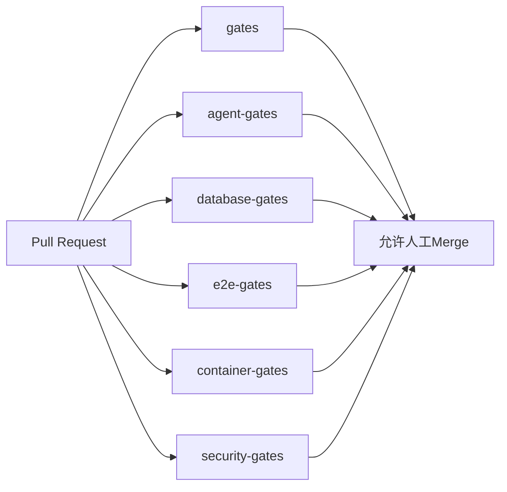

# PolicyOps P0 合并质量门禁与 v0.2.0 发布

> Author: Jan
> Status: Approved
> Updated: 2026-09-03

## 文档元数据

| 字段 | 值 |
| --- | --- |
| PRD文件 | `09-03-stage-policyops-pre-merge-release.md` |
| 类型 | Stage |
| 状态 | Approved |
| 前置依赖 | Stage 01～07 已验收；Auth Feature 已由提交 `71da7fc` 交付并推送至 `refactor/policy-ops-agent-platform` |
| 可并行阶段 | Python质量修复与镜像加固可在测试契约固定后独立实施；数据库、E2E、文档收口和合并发布必须串行 |
| 后续消费者 | `main` 主分支、Personal Demo部署、后续PolicyOps和身份功能开发 |
| 退出门禁 | 六项CI、完整差异审阅、主分支保护、`v0.1.0 → v0.2.0` 标签与Release闭环全部取得可核验结果 |
| 对应总体需求 | FND-FR-009～010、CORE-AC-002、AUTH-AC-020、PRD-NFR-001～007 |

## 1. 背景与现状

PolicyOps七阶段重构及用户与管理员双角色鉴权已经在
`refactor/policy-ops-agent-platform`完成。截至本PRD创建时，分支工作树干净，
Auth提交`71da7fc feat: 完成用户与管理员双角色鉴权`已推送，当前分支相对
`origin/main`为0个落后、20个领先提交。

当前新鲜检查结果为：

- Node单元/契约测试单独执行时230项通过、25项因缺少数据库环境跳过；
- 全新PostgreSQL 17执行两次Core migration、两次管理员引导、seed后，7个数据库测试文件、27项测试通过；
- Chromium Auth E2E 10项通过；ESLint、TypeScript和Next生产构建通过；
- Python pytest 37项通过、6项因环境跳过，但Ruff仍有31项、Mypy仍有20项错误；
- 仓库Secret扫描覆盖526个候选文件且无命中；Gitleaks全历史扫描存在5个已核实的DSL业务键误报；
- 生产Compose引用`AUTH_REFRESH_PEPPER`，但`infra/prod/.env.example`未提供该变量，`compose config`以空值告警通过；
- 当前`.github/workflows/ci.yml`只有Node门禁和两个Repository测试，尚未覆盖Auth数据库集成、E2E、Python质量、镜像构建、Compose冒烟和镜像漏洞扫描；
- 当前没有PR、版本标签、GitHub Release或已核实的`main`必需状态检查配置。

检查还发现Auth E2E存在假阳性：应用通过AI SDK默认调用`/v1/responses`，而本地mock只实现
`/v1/chat/completions`。请求返回404后，测试只验证用户消息和会话持久化，没有断言助手回复，
因此10项E2E仍显示通过。当前部署目标DeepSeek使用Chat Completions接口，本阶段必须在合并前
修正该协议选择和测试断言。

若不完成本阶段，`main`可在缺少Python、完整数据库、浏览器、容器和安全证据时被合并，
Auth E2E假阳性及配置缺口也会随版本发布，后续Agent还会继续被过期测试统计和下一步误导。

## 2. 目标

- 修正Auth对话E2E假阳性，确保真实助手流式回复和持久化均被验证。
- 将Node单元、PostgreSQL集成、Chromium E2E分为独立、无环境跳过的测试入口。
- 为Agent Runtime建立pytest、Ruff、Mypy和pip-audit阻断门禁。
- 在全新pgvector PostgreSQL 17上验证Core、Auth和Agent migration、seed、管理员引导、角色隔离及全部数据库行为。
- 构建并冒烟Web与Agent镜像，验证生产Compose配置和健康检查。
- 对完整Git历史执行Secret扫描，对运行镜像执行可修复HIGH/CRITICAL漏洞扫描。
- 建立六个GitHub必需状态检查和禁止直接/强推`main`的人工合并流程。
- 将当前`main`标记为`v0.1.0`基线，将合并后的PolicyOps+Auth版本发布为`v0.2.0`。
- 清理活动文档中的过期状态和统计，保留archive与历史报告原貌。

## 3. 非目标

- 不新增产品功能、角色类型、权限模型、数据库业务表或对外业务API。
- 不重新实现或拆分Auth提交`71da7fc`。
- 不改变规则引擎、政策数字结论、RAG质量阈值或Agent只能创建draft的不变量。
- 不把真实SiliconFlow、DeepSeek或其他外部模型密钥放入CI。
- 不执行生产migration、管理员引导、Secret配置或轮换、停写、DNS或入口切换。
- 不自动创建或合并PR，不直接推送或force-push `main`。
- 不自动修改GitHub分支保护，不自动创建/推送标签或发布Release；这些操作保留为人工暂停点。
- 不删除、不重写archive、历史阶段报告或既有生产数据。

## 4. 用户故事

- **PMG-US-001** 作为维护者，我需要每个PR自动执行完整的Node、Python、数据库、浏览器、容器和安全门禁，从而不能以局部测试代替发布证据。
- **PMG-US-002** 作为维护者，我需要Auth E2E验证真实助手回复而不是只验证消息落库，从而消除成功状态下的协议404假阳性。
- **PMG-US-003** 作为发布者，我需要通过受保护的`main`和人工PR审阅合并重构，从而禁止直接强推绕过门禁。
- **PMG-US-004** 作为发布者，我需要重构前后的明确版本锚点，从而可以比较、审计和回退`v0.1.0`与`v0.2.0`。
- **PMG-US-005** 作为后续Agent，我需要当前文档只展示有效状态、实际测试数量和精确下一步，从而不会按过期记录执行。

## 5. 功能与工程需求

### 5.1 Auth对话验收修正

- **PMG-FR-001 Chat Completions协议**：`createChatStream`必须显式使用AI SDK的
  `openai.chat(model)`；不得继续由默认模型选择`/responses`。仅适用于Responses API的
  `store:false`设置必须删除。DeepSeek仍使用现有`OPENAI_URL`和`OPENAI_MODEL`配置，
  不增加新的模型配置分支。
- **PMG-FR-002 E2E真实回复**：Auth E2E必须先新增对固定mock助手文本的可见性和持久化断言，
  在协议修正前因404形成Red；修正后用户消息、助手流式回复、刷新后的会话内容都必须通过。
  E2E服务日志不得出现mock 404或未处理AI API错误。
- **PMG-FR-003 跨平台E2E入口**：以`scripts/run-auth-e2e.mjs`和
  `npm run test:e2e:auth`作为唯一正式入口，支持Windows PowerShell和Ubuntu runner，
  支持透传Playwright参数，验证数据库URL存在且`NEXTAUTH_SECRET`与
  `AUTH_REFRESH_PEPPER`均非空且不相等。旧Bash脚本在引用全部迁移后删除。
- **PMG-FR-004 Standalone E2E启动**：E2E必须运行`output: standalone`产物，启动命令使用
  `node .next/standalone/server.js`。执行入口在启动前把`public`和`.next/static`复制到
  standalone期望的构建目录；不得继续使用会产生兼容警告的`next start`。

### 5.2 Node测试分层

- **PMG-FR-005 单元测试入口**：`npm test`只运行不依赖数据库或外部服务的测试，
  不得通过`describe.skipIf`产生环境跳过。现有纯jurisdiction tree测试保留在单元层，
  其数据库测试拆到集成文件。
- **PMG-FR-006 数据库测试入口**：全部数据库测试使用`*.integration.test.ts`命名，
  由`vitest.integration.config.ts`和`npm run test:db`统一运行。配置必须关闭文件并行，
  避免共享数据库状态互相污染。
- **PMG-FR-007 慢测试稳定性**：Excel/workbook解析和seed动态导入测试只在自身设置
  15秒上限；不得提高全项目默认timeout，也不得删减851条案例或500条回归数据验证。

### 5.3 Python质量与测试分层

- **PMG-FR-008 Python工具链**：Agent dev dependencies必须包含并锁定Ruff 0.16.5、
  Mypy 2.3.1和pip-audit 2.10.1，并加入`lxml`、`openpyxl`所需类型stub。
- **PMG-FR-009 Ruff门禁**：Ruff目标为Python 3.11，检查`agent`和`tests`，规则至少包含
  `E4`、`E7`、`E9`、`F`、`I`、`B`、`UP`、`RUF`、`SIM`。不得用全局忽略掩盖现有错误。
- **PMG-FR-010 Mypy门禁**：Mypy检查`agent`生产包，启用`check_untyped_defs`、
  `no_implicit_optional`和`warn_unused_ignores`。只允许对确实没有类型声明的
  `celery.*`、`fitz`、`ijson`和`jieba`做模块级`ignore_missing_imports`。
- **PMG-FR-011 Python测试入口**：非数据库pytest不得出现环境跳过；
  `test_closed_loop`移除无实际数据库依赖的条件。PostgreSQL、Checkpoint和RAG数据库测试
  统一标记`integration`，由数据库job单独运行。
- **PMG-FR-012 确定性RAG质量测试**：CI中的RAG数据库质量门禁使用
  `FakeSiliconFlowClient`和固定语料，不读取local env或真实API Key；真实模型验证继续由
  `validate_siliconflow`人工路径承担。
- **PMG-FR-013 Python缺陷清理**：Ruff/Mypy发现的错误必须修复而不是排除。至少包括：
  `node_event(...) -> AgentEvent`、事件仓储类型一致性、可空DOCX样式访问、RAG评分数值类型、
  FTS实际使用分词查询、无效占位/不可达逻辑和测试中的宽泛异常断言。
- **PMG-FR-014 Python警告**：pytest必须在`services/agent`工作目录加载自身pyproject。
  Starlette TestClient/httpx弃用警告应通过受支持的测试依赖或测试客户端迁移消除，
  不得仅用全局warning过滤器隐藏。

### 5.4 Core/Auth/Agent数据库门禁

- **PMG-FR-015 测试数据库**：数据库门禁使用全新的`pgvector/pgvector:pg17`服务，
  只注入合成CI口令。连接必须指向localhost GitHub service端口，不连接任何已有或远程数据库。
- **PMG-FR-016 数据库初始化顺序**：门禁依次执行Core migration两次、管理员引导两次、
  seed一次、Agent migration和角色授权；第二次migration及引导必须是成功的幂等no-op。
- **PMG-FR-017 完整Node数据库套件**：必须覆盖Repository CRUD/回滚/并发、identity注册与刷新并发、
  最后管理员、jurisdiction tree、snapshot、regional isolation、Shanghai migration和materialize。
- **PMG-FR-018 完整Python数据库套件**：必须覆盖Agent schema与角色隔离、PostgresSaver恢复、
  RAG采集/检索及确定性RAG质量门禁。数据库环境存在时任何集成测试不得skip。
- **PMG-FR-019 Agent角色引导**：普通Agent schema migration不得以默认`change-me`创建角色。
  `--with-roles`必须要求口令，并在每次执行时幂等创建或更新`agent_app`口令与权限。
  角色隔离测试必须从`AGENT_DATABASE_URL`派生host、port和dbname，不得写死
  `localhost:5433/drill01`。

### 5.5 六项CI

- **PMG-FR-020 Node门禁**：保留检查名`gates`，顺序执行`npm ci`、ESLint、TypeScript、
  `npm test`和生产构建。
- **PMG-FR-021 Agent门禁**：新增`agent-gates`，顺序执行冻结依赖同步、Ruff、Mypy、
  非integration pytest和pip-audit。
- **PMG-FR-022 数据库门禁**：将`repository-gates`替换为`database-gates`，
  按PMG-FR-015～019初始化并运行完整Node/Python数据库套件。
- **PMG-FR-023 E2E门禁**：新增`e2e-gates`，安装Chromium及系统依赖，在全新PostgreSQL 17上
  执行migration、引导、seed、build和`npm run test:e2e:auth`。
- **PMG-FR-024 容器门禁**：新增`container-gates`，验证Compose、构建`web:latest`和
  `agent:latest`，以合成env和临时卷启动proxy/web/agent/worker/beat/postgres/redis/minio，
  检查`/api/health`和`/internal/health`后无条件`docker compose down -v`。
- **PMG-FR-025 安全门禁**：新增`security-gates`，执行仓库Secret扫描和Gitleaks完整历史扫描；
  Trivy镜像扫描可与`container-gates`共享已构建镜像，但结果属于必需容器门禁的一部分。
- **PMG-FR-026 CI触发与权限**：工作流只在`pull_request`、`main` push和人工dispatch触发；
  设置同ref并发取消和job timeout。默认`GITHUB_TOKEN`仅`contents: read`，Gitleaks关闭PR评论，
  不授予写权限。
- **PMG-FR-027 Action固定**：第三方Action必须使用以下完整提交SHA，并保留版本注释：
  `actions/checkout@d23441a48e516b6c34aea4fa41551a30e30af803`（v6）、
  `actions/setup-node@249970729cb0ef3589644e2896645e5dc5ba9c38`（v6）、
  `astral-sh/setup-uv@c771a70e6277c0a99b617c7a806ffedaca235ff9`（v9.0.0）、
  `gitleaks/gitleaks-action@e0c47f4f8be36e29cdc102c57e68cb5cbf0e8d1e`（v3）、
  `aquasecurity/trivy-action@ed142fd0673e97e23eac54620cfb913e5ce36c25`（v0.36.0）。

### 5.6 Secret与镜像安全

- **PMG-FR-028 Gitleaks基线**：Gitleaks固定扫描器版本8.29.1并使用`fetch-depth: 0`。
  只允许在`.gitleaksignore`记录以下已核实的历史误报fingerprint，不得创建目录级忽略：

```text
2fb225a325e7fe8cb12bd0b3d08b4cc2a4b5648f:dsl/ssp_dsl_v1/rules/R-500-4050-ELIGIBILITY.json:generic-api-key:121
2fb225a325e7fe8cb12bd0b3d08b4cc2a4b5648f:dsl/ssp_dsl_v1/rules/R-510-4050-AMOUNT.json:generic-api-key:14
2fb225a325e7fe8cb12bd0b3d08b4cc2a4b5648f:dsl/ssp_dsl_v1/rules/R-510-4050-AMOUNT.json:generic-api-key:197
2fb225a325e7fe8cb12bd0b3d08b4cc2a4b5648f:dsl/ssp_dsl_v1/rules/R-540-SUBSIDY-MUTUAL-EXCLUSION.json:generic-api-key:14
2fb225a325e7fe8cb12bd0b3d08b4cc2a4b5648f:dsl/ssp_dsl_v1/rules/R-540-SUBSIDY-MUTUAL-EXCLUSION.json:generic-api-key:29
```

- **PMG-FR-029 Trivy阈值**：Trivy固定0.74.0，扫描Web和Agent最终运行镜像的OS与语言依赖。
  存在已有修复版本的HIGH或CRITICAL时退出1；未修复项仍输出报告，不得用宽泛ignore隐藏。
- **PMG-FR-030 Web镜像加固**：构建占位配置不得使用Docker `ARG`/`ENV`保存Secret名称；
  仅在执行build的单层命令中使用非真实占位值。最终运行镜像删除不需要的npm/npx，
  更新可修复Alpine系统包并继续使用非root用户。
- **PMG-FR-031 Agent镜像加固**：uv只存在于build stage；最终运行镜像删除不需要的全局
  pip/setuptools/wheel构建工具，保留非root用户和运行所需venv。

### 5.7 配置、版本与文档

- **PMG-FR-032 Auth Secret配置**：根`.env.example`、`infra/prod/.env.example`和活动运行配置模板
  都必须包含`AUTH_REFRESH_PEPPER`，并明确与`NEXTAUTH_SECRET`不同。Compose使用必填插值拒绝缺失或空值，
  应用启动配置负责拒绝两者相同。
- **PMG-FR-033 版本统一**：Web `package.json`/lock、Agent `pyproject.toml`/`uv.lock`中的项目版本
  统一从0.1.0提升至0.2.0；不得连带升级无关运行依赖。
- **PMG-FR-034 当前文档同步**：将Auth PRD顶部和内部状态统一为仓库合法状态`Active`，
  Auth完成事实仍由`PROGRESS.md`和验收报告记录为Accepted。同步ARCHITECTURE、TESTING、OPERATIONS、
  traceability、reports README、相关模块README和本PRD。
- **PMG-FR-035 进度清理**：`PROGRESS.md`必须替换“提交并推送本次文档重组”等失效下一步，
  写入本阶段状态、最终测试数量、CI和发布暂停点。活动traceability删除“112测试”静态口径，
  改为完整Node回归、黄金规划和迁移对账。archive和历史报告不得改写。
- **PMG-FR-036 验收证据**：新建本阶段验收报告，记录环境、提交SHA、命令、退出码、测试数量、
  skip/warning、镜像摘要、Trivy/Gitleaks结论和六项GitHub检查链接。报告不得包含Secret、
  完整Cookie、密码哈希、连接串、用户数据或完整向量。

### 5.8 主分支与发布治理

- **PMG-FR-037 完整差异审阅**：提交后以固定的`origin/main...HEAD`范围审阅全部代码、migration、
  权限、容器、文档和删除项，并在验收报告记录merge-base、head SHA、diff统计和结论。
- **PMG-FR-038 主分支规则**：`main`必须启用Active ruleset：只允许PR合并、解决所有对话、
  分支保持最新，必需检查为`gates`、`agent-gates`、`database-gates`、`e2e-gates`、
  `container-gates`、`security-gates`；禁止删除、force-push和绕过。不要求外部审批，
  不启用linear history，以允许本次merge commit。
- **PMG-FR-039 人工PR合并**：PR必须由用户人工创建并从Draft转Ready；六项检查和完整审阅通过后，
  使用merge commit合入。Agent不得直接创建/合并PR或推送`main`。
- **PMG-FR-040 版本边界**：合并前在当前`origin/main`精确提交创建annotated tag `v0.1.0`并发布
  “Pre-PolicyOps baseline”；合并后等待main六项CI再次通过，再在merge commit创建annotated tag
  `v0.2.0`并发布PolicyOps+Auth Release。
- **PMG-FR-041 强制暂停**：配置GitHub ruleset、创建/合并PR、创建/推送tag、发布Release以及任何
  生产迁移、Secret轮换或入口切换前，Agent必须停止并取得用户对该外部动作的明确授权。

## 6. 非功能需求

- **PMG-NFR-001 可重复**：所有依赖使用lock；CI不依赖开发机缓存、已存在容器、生产数据或外部模型。
- **PMG-NFR-002 确定性**：单元、数据库和E2E均使用固定时钟/随机替身、合成Secret和本地模型mock；
  不允许sleep等待业务过期。
- **PMG-NFR-003 失败关闭**：lint、类型、测试、audit、Secret、漏洞、build、config或health任一步失败，
  对应job必须失败；不得使用`continue-on-error`或无条件成功收尾掩盖失败。
- **PMG-NFR-004 零未解释跳过**：每个job只运行自身层级，结果不得包含环境造成的skip；
  外部真实模型测试必须有独立人工命令和明确不进入CI的理由。
- **PMG-NFR-005 零未解释警告**：新增或已有warning必须修复，或在验收报告按来源、影响和处理决定逐项解释；
  安全、类型、弃用和配置警告不得被接受为普通噪声。
- **PMG-NFR-006 最小权限**：CI token只读，数据库和服务使用临时合成凭据，镜像以非root运行，
  PR与发布动作不由CI自动执行。
- **PMG-NFR-007 可审计**：需求、实现、测试、CI check、提交、PR、tag和Release之间有唯一追踪路径。
- **PMG-NFR-008 可回退**：CI改造可通过revert单一P0提交恢复；应用仍可回退`v0.1.0`镜像，
  不需要删除Auth新增表或改写历史数据。
- **PMG-NFR-009 时限**：单元/静态job目标15分钟内、数据库/E2E/容器job目标30分钟内完成；
  超时视为失败，不通过降低覆盖面解决。

## 7. 实现设计

### 7.1 CI拓扑



六个job在独立GitHub-hosted runner上运行，不共享本地镜像、数据库或测试产物。
每个job独立完成最小初始化；不通过跨job缓存传递数据库和Secret。Node和uv依赖缓存只用于下载加速，
不得改变lock校验。

### 7.2 测试数据流

```text
unit runner       -> 无DATABASE_URL测试入口 -> Node/Python纯测试
database runner   -> fresh pgvector PG17    -> Core/Auth/Agent migrations -> DB suites
e2e runner        -> fresh PG17             -> Core migration/bootstrap/seed -> build -> Chromium
container runner  -> synthetic env          -> build images -> compose up -> health -> down -v
```

数据库job和E2E job使用不同数据库实例。任何测试清理只能作用于当前runner创建的数据库，
不得读取`.env`或`.env.local`回退连接。

### 7.3 任务与提交边界

本阶段是一个接受或拒绝整体门禁的Stage任务，最终只创建一个P0提交：

```text
ci: 补齐鉴权后的合并门禁与发布流程
```

提交前必须检查完整staged diff和候选敏感文件。若实现中发现与本PRD无关的产品缺陷，
停止并建立独立需求，不将其夹带进P0提交。

## 8. 数据模型与不变量

- 不新增或修改业务Schema；沿用Core迁移0000～0008与Agent现有迁移。
- 测试只验证migration的全新库、重复执行和权限结果，不生成新的生产迁移。
- `users`、`auth_refresh_sessions`、`auth_audit_events`及历史匿名资源语义保持Auth PRD定义。
- `agent_app`只能访问Agent授权范围，不能读取或写入Core private表。
- Published规则、政策和快照不可修改；Agent仍只能物化draft。
- `NEXTAUTH_SECRET`、`AUTH_REFRESH_PEPPER`、Agent JWT和数据库口令不得相同或写入仓库。

## 9. API、事件与类型

### 9.1 运行接口

- 现有浏览器和服务API路径、请求/响应及稳定错误码保持不变。
- 唯一出站协议修正为：聊天模型通过OpenAI-compatible `POST /chat/completions`流式接口调用。
- `node_event`内部返回类型从非约束dict收敛为`AgentEvent`；EventRepository接口不变。

### 9.2 开发与CI接口

```text
npm test                 # Node unit/contract，无数据库skip
npm run test:db          # Node PostgreSQL integration，串行
npm run test:e2e:auth    # 跨平台Auth Chromium E2E
uv run pytest -m "not integration"
uv run pytest -m integration
uv run ruff check agent tests
uv run mypy agent
uv run pip-audit
```

GitHub必需检查名称属于发布接口，后续不得无迁移说明重命名：

```text
gates
agent-gates
database-gates
e2e-gates
container-gates
security-gates
```

## 10. 迁移与兼容

- 本阶段只在一次性测试数据库应用迁移，不接触本机保留的生产Compose数据卷。
- Core migration和管理员引导重复执行必须成功且不产生重复管理员、重复Schema或凭据输出。
- Auth旧匿名数据保持原样；新应用和`v0.1.0`回退行为继续遵循Auth PRD。
- `v0.1.0`指向合并前当前`origin/main`，不得指向refactor分支或重写已有提交。
- `v0.2.0`只在merge commit的main CI通过后创建，不得指向PR head。
- 如果main在准备期间前进，先把最新main合入refactor分支、解决冲突并重跑六项门禁，
  再重新确认v0.1.0目标与PR差异。

## 11. 安全、隐私与可观测

- CI日志只能输出合成标识、测试数量、镜像摘要和脱敏扫描结论。
- 不输出密码、bcrypt hash、刷新Secret、完整Cookie、Authorization、连接串或生产域名。
- Gitleaks和Trivy结果保留在Actions日志；发现真实Secret时立即失败并停止，不自动改写Git历史或轮换Secret。
- 镜像扫描只扫描最终运行镜像；构建阶段依赖问题由pip-audit和lock审查补充。
- Compose冒烟只暴露GitHub runner本机端口，完成后无条件删除容器和临时卷。
- CI job失败必须上传或保留足够日志定位具体层级，但报告不得复制敏感原文。

## 12. 失败模式、重试与回退

| 失败 | 行为 | 重试/回退 |
| --- | --- | --- |
| Node慢测试偶发超时 | 保留失败，核实局部15秒预算与实际耗时 | 修复性能或稳定性后重跑，不提高全局timeout |
| migration或引导第二次执行失败 | database/e2e job失败 | 修复幂等后从全新数据库重跑 |
| 数据库测试出现skip | database job失败 | 修正marker或环境，不允许以skip关闭 |
| E2E出现AI 404或无助手回复 | e2e job失败 | 修正Chat Completions路径或mock，不放宽断言 |
| Ruff/Mypy/pip-audit失败 | agent job失败 | 修复代码、类型或升级依赖，不全局忽略 |
| Gitleaks发现非基线项 | security job失败并停止 | 人工判定；真实Secret需另获授权轮换 |
| Trivy发现可修复HIGH/CRITICAL | container job失败 | 更新基础镜像/依赖或删除无用工具后重建 |
| Compose缺少必填Secret | config步骤失败 | 补齐合成CI值；不得回退为空值 |
| 容器健康超时 | container job失败并输出脱敏日志 | 修复依赖或健康检查后全量重跑 |
| main在审阅期间前进 | 禁止直接合并 | 同步main、重新审阅并重跑六项检查 |
| P0改造需回退 | revert单一P0提交 | 恢复旧CI；不得删除Auth表或历史数据 |

## 13. 交付物

- 完整六job GitHub Actions工作流与固定Action SHA。
- Node unit、database、Auth E2E脚本和配置。
- Auth Chat Completions修正及助手回复E2E断言。
- Python质量配置、锁文件、类型/风格修复和测试分层。
- Agent角色migration幂等修正和可移植角色隔离测试。
- Web/Agent运行镜像加固与生产Compose必填配置。
- `.gitleaksignore`精确基线、Secret和Trivy门禁。
- Web/Agent 0.2.0版本元数据。
- 更新后的当前架构、测试、运维、traceability、progress和README状态。
- 本阶段验收报告、完整差异审阅记录和人工发布检查单。

## 14. 测试矩阵

| 类型 | 需求 | 场景 | 通过条件 |
| --- | --- | --- | --- |
| Auth Red/Green | PMG-FR-001～004 | mock只支持Chat Completions，E2E断言助手回复 | 修复前因404失败；修复后回复和刷新持久化通过、无404 |
| Node单元 | PMG-FR-005/007 | 规则、Auth、路由契约、Excel、seed | 全部通过，数据库环境skip为0 |
| Python单元 | PMG-FR-008～014 | FastAPI、Graph、Draft、RAG纯逻辑 | Ruff/Mypy/pytest/pip-audit全部通过，skip为0、未解释warning为0 |
| PostgreSQL集成 | PMG-FR-015～019 | migration幂等、引导、Repository、Auth并发、snapshot、地区、materialize、Agent/RAG | 全新pgvector PG17全部通过，集成skip为0 |
| Chromium E2E | PMG-FR-002～004/023 | 注册、登录、对话、管理员、临时密码、禁用 | 10项关键流程及助手回复通过，真实Next standalone运行 |
| Compose | PMG-FR-024/032 | config、完整服务启动、健康检查、清理 | config无缺失值，Web/Agent健康，临时卷已删除 |
| Secret | PMG-FR-025/028 | 当前文件和完整Git历史 | 除5个精确业务键误报外0发现 |
| 镜像漏洞 | PMG-FR-029～031 | Web/Agent最终运行镜像 | 可修复HIGH=0、CRITICAL=0，非root运行 |
| 文档 | PMG-FR-034～036 | 状态、链接、统计、下一步、追踪 | 活动事实一致、0断链、无过期进度，历史证据未改写 |
| 发布治理 | PMG-FR-037～041 | diff审阅、ruleset、PR、main复验、tag/Release | 所有人工证据存在且tag指向正确提交 |

## 15. 验收场景

- **PMG-AC-001** Given当前Auth E2E mock仅支持`/chat/completions`，When先增加助手回复断言，Then测试因现有`/responses` 404失败；完成协议修正后测试通过且无AI API错误日志。
- **PMG-AC-002** Given没有数据库环境的Node runner，When执行`npm test`，Then全部单元/契约测试通过且数据库skip为0。
- **PMG-AC-003** Given没有数据库环境的Agent runner，When执行Ruff、Mypy、非integration pytest和pip-audit，Then全部退出0且环境skip为0、未解释warning为0。
- **PMG-AC-004** Given全新pgvector PostgreSQL 17，When依次执行Core migration两次、引导两次、seed、Agent migration和角色授权，Then全部成功且没有重复对象、默认角色密码或凭据输出。
- **PMG-AC-005** Given已初始化测试库，When执行`npm run test:db`，ThenRepository、Auth、snapshot、regional isolation和materialize全部通过且skip为0。
- **PMG-AC-006** Given同一测试库的Agent schema和角色，When执行Python integration，Then角色隔离、Checkpoint、RAG集成和RAG质量全部通过且skip为0。
- **PMG-AC-007** Given全新E2E数据库和生产standalone构建，When执行`npm run test:e2e:auth`，Then10项Auth流程及助手回复通过，未访问外部模型。
- **PMG-AC-008** Given缺少或为空的`AUTH_REFRESH_PEPPER`，When执行Compose config或启动Web，Then配置失败；Given与NextAuth不同的合成值，Thenconfig通过。
- **PMG-AC-009** Given新构建的Web和Agent镜像，When执行Compose冒烟和Trivy扫描，Then健康检查通过、临时资源删除、可修复HIGH/CRITICAL为0。
- **PMG-AC-010** Given完整Git历史，When执行仓库Secret扫描和Gitleaks，Then除五个精确fingerprint外无发现，任何新发现都会阻断。
- **PMG-AC-011** GivenPR指向`main`，When任一六项检查失败、分支落后或对话未解决，ThenGitHub禁止merge。
- **PMG-AC-012** Given六项检查和完整人工审阅全部通过，When用户选择merge commit，Then`main`只增加经PR合并的重构历史，没有直接或force push。
- **PMG-AC-013** Given当前main与最终merge commit，When人工发布，Then`v0.1.0`准确指向重构前main，`v0.2.0`准确指向main上的merge commit，两个Release均包含可追踪说明。
- **PMG-AC-014** Given后续Agent读取活动文档，When检查当前任务、测试统计和下一步，Then不会看到文档重组、112项基线、旧演练执行中或失效授权描述。

## 16. Definition of Done

- PMG-FR-001～041和PMG-NFR-001～009全部映射到真实实现、测试或人工治理证据。
- PMG-AC-001～014全部取得新鲜证据，不用Auth旧验收报告代替新门禁验证。
- Auth协议修正有真实Red/Green记录；纯CI/文档配置记录无法制造业务Red的原因并验证失败路径。
- Node unit、Python unit、Node/Python数据库、Chromium、Docker/Compose、Secret和Trivy全部通过。
- 每个自动job的环境skip为0；warning为0或在验收报告逐项解释且不属于安全、类型、弃用或缺配置问题。
- Web和Agent最终镜像均无可修复HIGH/CRITICAL，继续使用非root运行。
- 六个GitHub检查名称稳定并配置为main必需状态检查。
- 完成`origin/main...HEAD`全量差异审阅，记录merge-base与head SHA。
- 当前文档、traceability、PROGRESS、验收报告和相关README同步；完成时不存在Draft或Updating README。
- Web与Agent版本统一为0.2.0，lock与manifest一致。
- 提交前检查完整staged diff，扫描Secret、私钥、生产数据、用户数据和生成依赖目录。
- 创建唯一提交`ci: 补齐鉴权后的合并门禁与发布流程`并推送当前upstream。
- Agent在PR、ruleset、main、tag、Release及生产动作前停止；只有用户明确授权后才可继续对应外部操作。
- 用户人工完成`v0.1.0`基线、PR、ruleset、merge commit、main复验和`v0.2.0`Release后，本阶段方可在PROGRESS中记录Accepted。

## 17. 人工合并与发布检查单

### 17.1 分支完成后暂停

Agent必须向用户报告：

- P0提交SHA和upstream同步状态；
- 六项job的命令、退出码、测试数量和Actions链接；
- skip、warning、Gitleaks与Trivy汇总；
- Web/Agent镜像摘要；
- `origin/main...HEAD`完整diff统计与审阅结论；
- 未执行的外部动作清单。

### 17.2 用户人工动作

1. 确认`origin/main`未变化，在该提交创建并推送annotated tag `v0.1.0`，发布Pre-PolicyOps baseline。
2. 人工创建Draft PR：`refactor/policy-ops-agent-platform → main`。
3. 在六个check出现后配置main Active ruleset，检查名称与PMG-FR-038完全一致。
4. 审阅全部差异并解决所有对话，将PR转Ready。
5. 六项检查通过且分支最新后选择merge commit。
6. 等待main上的六项CI全部再次通过。
7. 在main merge commit创建并推送annotated tag `v0.2.0`，发布PolicyOps+Auth Release。
8. 将PR、merge SHA、tag和Release链接交回执行Agent完成最终文档记录。

## 18. 下一阶段输入

本阶段完成后提供：

- 受保护的`main`及六项稳定必需状态检查；
- 可重复的Node、Python、PostgreSQL、Chromium和Docker质量入口；
- 无Auth对话协议假阳性的v0.2.0代码基线；
- 可审计的`v0.1.0`重构前基线与`v0.2.0`PolicyOps+Auth Release；
- 后续功能可直接复用的CI job、测试数据库初始化和发布证据格式；
- 仍需单独授权的远程Personal Demo部署、生产migration、Secret配置/轮换和入口切换。
