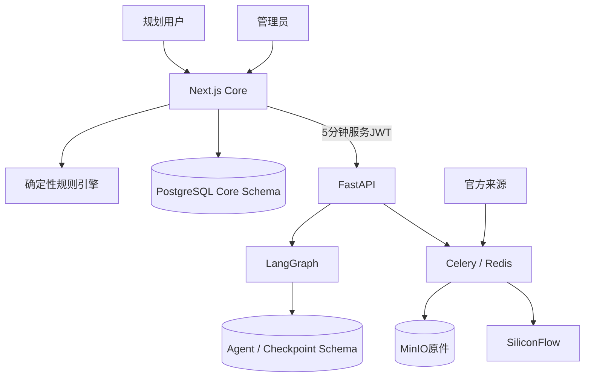
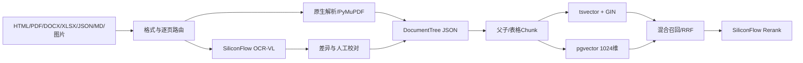

# PolicyOps Agent当前架构

> Author: Jan
> Status: Active
> Updated: 2026-09-02

## 上下文

PolicyOps在现有社保规划Core旁增加政策运营Agent。Next.js继续负责所有浏览器和用户业务；FastAPI、Celery和LangGraph只处理政策运营内部流程。

## Next.js Core

- 浏览器唯一入口和BFF。
- 统一登录注册（09-02）：`/login`、`/register`公开页面；user与admin共用入口；`/admin/login` 308重定向到统一登录。
- NextAuth v5 Credentials + 加密JWT Cookie保存15分钟授权声明（accessExpiresAt）与PostgreSQL刷新会话句柄；授权声明过期后由jwt callback经identity application验证并轮换刷新会话（行锁+HMAC确定性派生+30秒并发宽限，ADR-0007）。
- 客户端Session只暴露AuthenticatedActor：userId、username、role、authVersion、mustChangePassword。
- 用户、角色、状态、authVersion、刷新会话和安全审计事件保存于PostgreSQL（`users`、`auth_refresh_sessions`、`auth_audit_events`，migration 0008纯新增）。
- 规则、参数、测试、地区、快照、规划和发布归Core所有；新建规划/对话只绑定owner_user_id，session_id恒为NULL，历史匿名数据不在新入口展示。
- 服务端路由门禁（src/proxy.ts）执行固定双角色权限矩阵：匿名访问规划/对话/管理一律拒绝；管理敏感写操作经requireFreshAdmin重新查询数据库校验role、status和authVersion。
- Agent集成只暴露PolicyContext只读端口和受限DraftMaterialization端口。

依赖方向为`domain → application → infrastructure → route adapter`；Route Handler不得直接承载领域规则或越过Repository访问Drizzle。

## Agent Runtime

- FastAPI提供内部控制面、健康检查和版本化OpenAPI。
- Celery和Redis负责采集、解析、OCR、Embedding、索引、重试和死信。
- LangGraph负责需要模型推理、Checkpoint和人工interrupt的状态流程。
- Worker并发和prefetch均为1，耗时任务不在FastAPI请求线程执行。
- Agent数据库角色只访问Agent和Checkpoint范围，不能直接写Core published表。

## 服务鉴权

- Next到FastAPI只通过Docker内网访问。
- 服务JWT使用HS256、5分钟TTL、30秒时钟偏差。
- Claims包含issuer、audience、subject、jti、iat和exp。
- current/previous Secret支持轮换。
- 审核和draft物化使用jti与幂等键防止重放。
- 浏览器和用户JWT不得获得内部服务Secret。

## 政策与规则模型

- `Jurisdiction`保存国家、省、市、区县层级。
- 国家政策形成baseline，地方版本使用add、replace、restrict和exempt overlay。
- 规则、参数、测试和政策携带business key、版本、地区、状态和有效期。
- 同级冲突和重叠有效期产生Conflict，不自动裁决。
- 发布快照保存解析后的地区继承链、版本集合、hash和provenance。
- JSON DSL继续保存在JSONB，并由AJV和JSON Schema校验。

## 文档、OCR与RAG

- HTML、DOCX、XLSX、JSON和Markdown优先原生解析。
- 文本PDF由PyMuPDF逐页提取，扫描或版面信息由PaddleOCR-VL-1.5处理。
- 原件保存到MinIO，DocumentTree是权威解析结构，Markdown是派生副本。
- 文号、日期、金额、比例冲突或缺少模型置信度时进入人工复核。
- 检索先过滤地区、有效期和发布状态，再执行全文、向量、RRF和重排。
- SiliconFlow Embedding为`BAAI/bge-m3`，实测维度1024；Rerank为`BAAI/bge-reranker-v2-m3`。

## 草案闭环

1. 比较完整新旧DocumentTree。
2. 检索受影响规则、参数、测试和历史案例。
3. 生成带引用、地区、有效期和provenance的DraftBundle。
4. 执行结构、引用、依赖和回归校验。
5. 管理员批准、编辑后批准或驳回。
6. 已批准Bundle通过服务JWT和幂等键调用Next Core。
7. Core二次校验后只创建draft；发布继续执行现有门禁。

## 数据所有权

| 数据 | 权威存储 | 所有者 |
| --- | --- | --- |
| 用户、会话、规划 | PostgreSQL Core | Next Core |
| 规则、参数、测试、地区、快照 | PostgreSQL Core | Next Core |
| Agent Run、提案、审核、事件 | PostgreSQL Agent | Agent Runtime |
| Graph Checkpoint | PostgreSQL Checkpoint | LangGraph |
| 原始政策和页面资源 | MinIO | Ingestion |
| Chunk、全文和向量 | PostgreSQL Agent | RAG |

## 部署

Personal Demo使用单机Docker Compose：Caddy、Next.js、FastAPI、Celery Worker、Beat、PostgreSQL 17 + pgvector、Redis和MinIO。只有反向代理对外；其他服务使用内部网络。详细资源和恢复规则见[OPERATIONS](./OPERATIONS.md)。

## 已接受决策

- 保留Next.js Core，不引入NestJS。
- NextAuth 15分钟授权声明 + PostgreSQL刷新会话双层会话（ADR-0007）；固定双角色权限矩阵，不建立通用RBAC。
- 决策记录见[decisions](./decisions/)目录（ADR-0007起）。
- Python内部控制面使用FastAPI。
- LangGraph用于可恢复、需要人工中断的政策运营流程。
- PostgreSQL JSONB兼容现有JSON规则，pgvector与业务元数据同库。
- Personal Demo不在本地加载Docling完整流水线或OCR/VLM模型。
- 外部模型只接收公开政策和去标识化规则元数据。

历史ADR见[archive/decisions](./archive/README.md)。
