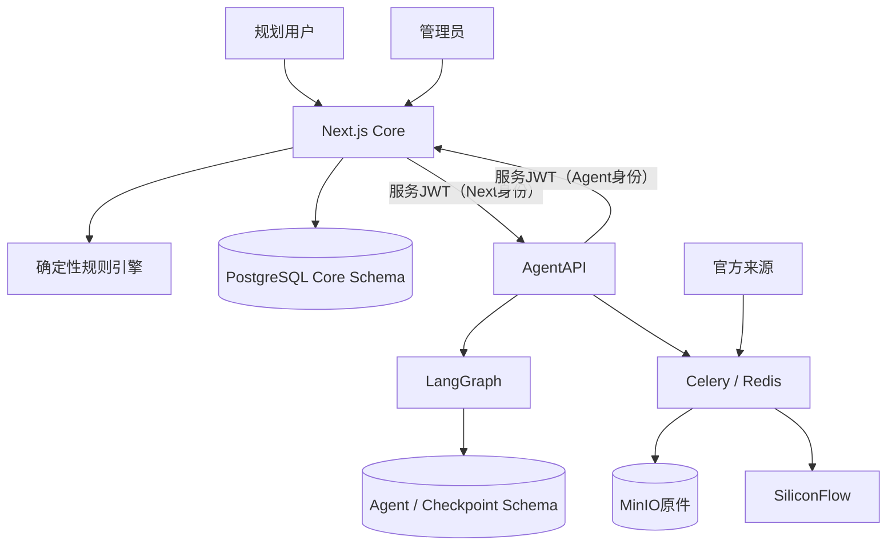
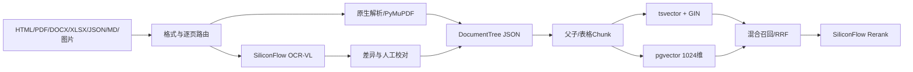

# PolicyOps Agent当前架构

> Author: Jan
> Status: Active
> Updated: 2026-09-16

## 上下文

PolicyOps在现有社保规划Core旁增加政策运营Agent。Next.js继续负责所有浏览器和用户业务；FastAPI、Celery和LangGraph只处理政策运营内部流程。

## Next.js Core

- 浏览器唯一入口和BFF。
- 统一登录注册（09-02）：`/login`、`/register`公开页面；user与admin共用入口；`/admin/login` 308重定向到统一登录。
- NextAuth v5 Credentials + 加密JWT Cookie保存15分钟授权声明（accessExpiresAt）与PostgreSQL刷新会话句柄；授权声明过期后由jwt callback经identity application验证并轮换刷新会话（行锁+HMAC确定性派生+30秒并发宽限，ADR-0007）。
- 客户端Session只暴露AuthenticatedActor：userId、username、role、authVersion、mustChangePassword。
- 用户、角色、状态、authVersion、刷新会话和安全审计事件保存于PostgreSQL（`users`、`auth_refresh_sessions`、`auth_audit_events`，migration 0008纯新增）。
- 规则、参数、测试、地区、快照、规划和发布归Core所有；新建规划/对话只绑定owner_user_id，session_id恒为NULL，历史匿名数据不在新入口展示。
- 服务端路由门禁（src/proxy.ts）执行固定双角色权限矩阵：匿名访问规划/对话/管理一律拒绝；管理敏感写操作经requireFreshAdmin重新查询数据库校验role、status和authVersion。
- Agent集成只暴露PolicyContext只读端口和受限DraftMaterialization端口。

依赖方向为`domain → application → infrastructure → route adapter`；Route Handler不得直接承载领域规则或越过Repository访问Drizzle。

## Agent Runtime

- FastAPI提供内部控制面和健康检查；文档与OpenAPI入口统一关闭（`docs_url`/`redoc_url`/`openapi_url`均为`None`，`/internal/docs`、`/docs`、`/redoc`、`/openapi.json`一律404，09-03复审缺漏一）。
- Celery和Redis负责采集、解析、OCR、Embedding、索引、重试和死信。
- LangGraph负责需要模型推理、Checkpoint和人工interrupt的状态流程。
- Worker并发和prefetch均为1，耗时任务不在FastAPI请求线程执行。
- Agent数据库角色只访问Agent和Checkpoint范围，不能直接写Core published表。

## 服务鉴权

- Docker内部网络是第一层隔离：Next与FastAPI仅通过内网互相调用；服务JWT是网络之外的第二层身份证明（ADR-0005）。
- Next与FastAPI双向通过短期服务JWT通信：HS256、TTL固定300秒、时钟偏差最多30秒（ADR-0005，09-03 Feature实现）。
- 固定身份：Next→Agent使用`iss=socila-next-core`、`aud=policy-agent`、`sub=next-core`；Agent→Core使用`iss=policy-agent`、`aud=socila-next-core`、`sub=agent-runtime`（09-05 SDL-FR-008自`ssp-next-core`一次性硬切换，Node/Python/CI冒烟/固定向量同提交原子切换，旧身份统一401不提供兼容）；claims另含UUID v4 `jti`、`iat`、`exp`（exp=iat+300，SJWT-FR-003～005）。
- 两端显式固定HS256（Node `jose`、Python `PyJWT>=2.10,<3`），拒绝`none`与任何算法降级；签发只使用current Secret，验证依次尝试current、previous；previous命中仅进入内部指标（SJWT-FR-002/007、NFR-001）。
- `AGENT_SERVICE_JWT_CURRENT`在web/agent/worker/beat四个消费者必填（≥32 UTF-8字节、previous与current相同或格式无效时启动失败，SJWT-AC-010）；`AGENT_SERVICE_JWT_PREVIOUS`可选，支持双窗口无中断轮换。
- Web Node运行时启动入口（`src/instrumentation.ts`，next dev/start与standalone server.js共用）启动期校验current Secret：缺失、不足32 UTF-8字节或与previous相同时以退出码1终止进程（Next 16 standalone中仅抛错不足以使进程退出，必须fail-fast），`/api/health`不构成绕过路径；instrumentation会被Next.js同时构建为Node与Edge运行时bundle，故启动校验与进程终止逻辑位于Node专用模块`src/lib/security/service-jwt-startup-node.ts`，`register`（async）仅在`NEXT_RUNTIME=nodejs`分支经动态import加载，Edge运行时不执行启动校验且构建零警告（2026-09-04运行时隔离复查）；Compose中`AGENT_SERVICE_JWT_CURRENT`为必填插值（`${…:?…}`），缺失或空值时`docker compose config`直接失败（09-03复审缺漏二）。
- FastAPI对除`/internal/health`（唯一免JWT内部端点）外的所有`/internal/*`业务端点验证Next身份令牌，`/internal/ready`必须携带合法JWT；Core仅在`/api/internal/v1/draft-imports`验证固定Agent身份（SJWT-FR-004/005、AC-015）。
- 鉴权失败（缺失、格式、签名、算法、claims、过期、超前、重放）统一返回401 `SERVICE_AUTH_INVALID`且不区分具体原因；重放存储不可用返回503 `SERVICE_AUTH_STORE_UNAVAILABLE`；两者均`Cache-Control: no-store`（SJWT-FR-009、AC-014）。
- `X-Service-Name`只作为不可信的结构化日志上下文，不参与允许/拒绝判断（SJWT-FR-006、AC-003）。
- 内部写请求（agent-run创建、proposal审核、draft物化）在接收方数据库事务内消费JTI：主键冲突视为重放统一401；业务回滚时JTI同回滚，调用方可用新JTI+相同业务幂等键安全重试（SJWT-FR-008、AC-011～013）。
- 重放表`public.service_jwt_replays`（Core，drizzle/0009）与`agent.service_jwt_replays`（Agent，migration 0007，`agent_app`最小读写）只保存JTI与claims元数据，不保存令牌或签名；过期行在消费时机会式清理（SJWT-NFR-006）。
- 浏览器和用户JWT不得获得内部服务Secret；JWT不含用户ID、用户名、角色或业务payload。
- 刷新会话HMAC pepper（`AUTH_REFRESH_PEPPER`）与`NEXTAUTH_SECRET`是两个独立密钥：compose必填插值拒绝缺失，identity容器启动时拒绝两者相同（09-03 PMG-FR-032）。

## 政策与规则模型

- DSL资产按"通用协议/地区资产"两层组织（09-05 SDL-FR-002）：通用Schema与发布工作流位于`dsl/protocol/socila_dsl_v1`，地区规则、参数、规则集、示例与Manifest位于`dsl/regions/<slug>_dsl_v1`（当前：`cn_dsl_v1`国家baseline、`guangdong_dsl_v1`广东、`sichuan_dsl_v1`四川、`shanghai_dsl_v1`上海）。
- 规则格式的唯一规范值为`SOCILA-DSL-1.0`（schema以`const`钉死）；`dsl_version`只表示JSON格式，不编码地区——地区由Manifest的`jurisdiction_code`表达（国家为`CN`，省级为行政区划代码），资产版本由`bundle_version`与实体版本独立递增（SDL-FR-001）。
- Seed经地区Manifest发现器（`src/lib/dsl/region-manifest.ts`）装载资产：校验Manifest与实际文件集合一致后把`jurisdiction_code`与路径交给装载器；装载代码不硬编码地区目录或行政区划（SDL-FR-004）。地区overlay允许仅提供参数（rules数组为空，如四川v1）。
- **显式overlay操作（09-05 NRP-FR-007）**：规则、参数、规则集均持久化`operation`（baseline/add/replace/restrict/exempt）与`target_business_key`列（drizzle/0012，CHECK约束强制：CN实体只能baseline、地区实体不能baseline、replace/restrict/exempt必带目标键、baseline/add不得带目标键）；合并器与快照服务不得按地区代码推断操作。replace/restrict/exempt必须解析到继承链上唯一上级业务键，add不得覆盖已存在键，冲突（missing-target/same-level-target/unknown-key/duplicate-add/same-level-overlap）阻止快照并落PolicyConflict。
- 国家baseline（NRP-FR-005）：全国统一的归一化/退休/养老/医保/失业框架规则与参数（渐进式延迟退休覆盖表、最低缴费年限时间线、失业金法定期限档、灵活就业基数区间）归属`CN`（规则集`RS-CN-PLAN-V1`、参数包`CN-BASELINE`）；地区执行标准以显式overlay落地（如上海失业金期限档表replace国家基线表、GD医保退休年限2030统一参数、GD医保退休restrict附加条件）。引擎与Seed按继承链装载参数（CN垫底、地区覆盖同名键）。
- 每个政策事实的evidence引用官方原件（document_id/artifact/content_sha256/locator/逐字excerpt）；`citation-contract.test.ts`验证摘录逐字存在于仓库内抓取原件，防伪造引用。政策含义无法从权威来源确定时不编码、转人工裁决（如四川医保退休年限待办）。
- 广东、四川示例包（`GD-EXAMPLE-BASE`、`SC-EXAMPLE-BASE`及四个示例参数）只是测试夹具（`src/server/modules/policy/__tests__/fixtures/regional-examples.ts`），生产Seed不写入（SDL-FR-012）。
- `Jurisdiction`保存国家、省、市、区县层级。
- **后台政策资产中文可读化（09-16 APR）**：`rule_sets`新增必填`name`、`params`新增必填`name`与可选`description`（migration 0020；纯显示元数据，业务身份仍是rule_set_id/param_id+jurisdiction+version）。四地区DSL文件逐项携带人工中文名称/说明，Seed与受控物化入口经`src/lib/dsl/display-names.ts`（assertDisplayMeta）强制名称非空且拒绝HTML尖括号；兼容迁移对无法对应DSL的旧行以实体编号回退命名（UI标记"名称待补充"，`isFallbackName`识别）。**显示元数据不参与政策内容哈希**：params的contentHash经`manifest.policyContentOf`剥离`name`/`description`；rule_set的名称漂移排除由`shapes.ts`的`ruleSetPayloadShape`不含`name`保证（description为原有业务字段仍参与）；`payloadShapeHash`增量判定同样不含显示字段——补写名称不触发快照/批次/物化delta漂移（APR-NFR-004，契约：`apr-display-metadata.test.ts`）。规则集管理入口唯一化：规则管理页只保留规则列表（APR-FR-001），独立`/admin/rule-sets`页按持久化`rule_id[]`顺序显示成员中文名称（`src/server/modules/rules/domain/rule-set-members.ts`复用policy域`mergePolicyContext`继承链/有效期/overlay语义批量解析，单查询装载候选，禁止逐成员N+1；无法解析成员保留原位置并禁止保存），详情与更新使用`rule_set_id+jurisdiction_code+version`精确身份（缺失400、不存在404），`GET /api/admin/rule-sets/[id]/candidates`提供名称/编号搜索选择器（排除已加入与不可解析候选，保存值仍为稳定编号）。发布中心每阶段内按规则集→规则→参数可折叠分组（数量之和=阶段总数），卡片以中文名称为主、操作仍用稳定身份；发布历史按`entity_type+jurisdiction_code+entity_id+entity_version`批量精确解析名称（`src/lib/admin/publish-history-names.ts`），身份缺失或实体不存在显示"名称不可用"、绝不以当前名称冒充历史名称（APR-NFR-005）。**修复轮（复审Important×6关闭）**：①候选装载`listRuleCandidates`按`rule_id∈成员 OR target_business_key∈成员`一次批量取回（非成员restrict/exempt/replace载体进入merge语义，有效期窗口`from<=as_of AND (to IS NULL OR to>=as_of)`），成员视图携带`overlays`（生效restrict/exempt载体精确身份，按应用顺序）与`contentRuleId`（replace后=载体行编号，展开/详情精确定位内容来源），页面分区显示基础内容与生效overlay且载体绝不进入执行顺序；②政策快照内容哈希统一入口`snapshotMembersContentHash`（`snapshot-service.ts`导出）：entityType+businessKey排序→投影剥离param`name/description`与rule_set`name`→canonical SHA-256，创建与`release-gates.canonicalMemberHash`及compute/replay重算端共享同一投影，存储成员payload保持完整（已存快照不可变，0020前旧payload无显示字段→投影no-op零漂移）；③Agent新参数草案强制正式名称：zod必填trim非空无尖括号+事务内服务级防线（直连同样422整体回滚零写入含台账），Python`ParamDraft`加可选`name/description`透传且`verify_bundle`同口径识别（can_review=False）；④参数引用反查去重身份`jurisdictionCode+ruleId`（版本比较限同地区，输出双键确定排序），索引仅published规则；⑤参数校验`validateParamRecord`暴露`display_name`检查项与`name_pending`（不阻断valid聚合，FR-017识别不阻止）；⑥APR数据库门禁MinIO镜像运行时解析CI Compose批准的quay.io固定digest（单一真相源）。
- 规则、参数、测试和政策携带business key、版本、地区、状态和有效期（params支持effective_to窗口装载）。
- 同级冲突和重叠有效期产生Conflict，不自动裁决。
- 发布快照保存解析后的地区继承链、版本集合、hash和provenance（provenance含operation与targetBusinessKey，NRP-AC-005）。
- JSON DSL继续保存在JSONB，并由AJV和JSON Schema校验（`dsl/protocol/socila_dsl_v1/schema/`）。
- **编辑字段白名单与测试隔离（09-05阶段E复审）**：管理端PATCH/PUT/POST经`src/lib/admin/entity-edit-policy.ts`白名单——受控字段（status/version/jurisdiction/businessKey/ID/policyPackId/时间戳等）与未知字段一律400，状态转换只能走publishing用例；blocked地区实体晋级被422拒绝。APR扩展白名单：规则集草稿允许`name`、参数草稿允许`name`/`description`（提交仍经assertDisplayMeta非空/无HTML校验），受控字段不因此放松。发布回归门禁按继承链地区加载测试（国家规则用CN测试，地方规则用目标地区+CN测试）。published完整性哈希为`to_jsonb`整行规范化哈希（UTC会话）。
- **受控物化（09-05阶段E）**：仓库权威资产进入持久库必须经`scripts/materialize-policy-regions.ts`（默认audit；apply需授权参数+manifest哈希+目标指纹三重校验；DATABASE_URL必须进程显式设置且仅限本机policyops，禁止dotenv回退）。首次四地区物化与repair已完成；后续物化必须按现有地区/类型/业务键/有效期/版本/内容计算确定性delta，只写新增或变化实体，未变化实体不得产生新版本。事务内目标计数由当前指纹+delta计算，任一校验失败全部回滚；published行永不原地修改。
- **draft包repair边界（WI-20260906-01/02，已验收并执行）**：目标指纹绑定全部draft包行状态和内容；repair事务内`FOR UPDATE`重校验并追加不可变`repaired`审计，原批次/成员不改写。持久库已完成0014与一次四包repair（验收报告§14～§15）；未来出现新漂移仍必须fresh audit并另行授权。
- **分地区交付与能力级缺口（ADR-0010）**：首期候选快照为CN、上海、广东；四川保持blocked、无快照且请求不得跨地区回退。广东2030年前医保退休地市年限缺参只触发R-220的`needs_agent`/`W-MI-LOCAL-YEARS-MISSING`，其他模块继续执行；2030年起使用省级男30年、女25年。
- **日期快照调度（ADR-0011，已实现；2026-09-09第二轮修复）**：任务3按地区和`as_of_date`选择唯一active快照区间（0017`effective_from/effective_to`+同地区active不重叠EXCLUDE约束）；缺失或无匹配区间fail-closed（409`POLICY_SNAPSHOT_UNAVAILABLE`）。发布必须真实执行七道门禁（引用/Schema/参数依赖/冲突/黄金测试/双重重放/成员规范化hash，JRP-FR-007），**空黄金测试集fail-closed**（至少一条适用测试才能记`golden_tests=pass`）；执行期每次重算成员hash并核对完整gateResults（JRP-FR-026）。**停用绑定URL地区**：`DELETE /api/admin/jurisdictions/:code/releases/:id`校验`code`与release记录地区一致，跨地区release ID抛`ReleaseJurisdictionMismatchError`（409，零写入，JRP-FR-027）。**历史重放三方hash**：`POST /api/plan/:id/replay`执行前同时比较plan保存的`snapshotContentHash`、快照行`contentHash`与成员重算规范化hash，任一不一致抛`ReplaySnapshotDriftError`（409 `REPLAY_SNAPSHOT_DRIFT`，fail-closed不产生规划结果，JRP-FR-028）；compute保存plan时写入快照内容hash（JRP-FR-009）。领取地市对外只接受六位行政代码（`profile.claim_city_code`），服务端确认属于广东启用地级市后转换为规则内部`claim_city`规范名称；未知/跨省/未确认城市不估算失业金额。新会话先经`POST /api/conversations`认证预创建再允许地区确认（JRP-FR-021）。激活入口为`POST /api/admin/jurisdictions/:code/release`（单数，与DELETE复数`releases/:id`并存）。
- **地区化合成案例（ADR-0011，2026-09-10第三轮修复+第四轮复审+第五轮修复）**：生成器、完整场景字段和36/18/18展示路径保持；受控归档边界已闭环——旧regression test按完整业务行计算非空64位hash（`testRowContentHash`，plan/apply共用，8业务字段漂移拒绝）、SHA清单精确覆盖7个必备文件、restore-report真实验证（全部表rows/64位hash与真实sequence状态，`buildVerifiedRestoreReport`统一生成）、selection-report由生成后showcase实际计算、42条DSL example保留/更新/新增/删除集合进入manifest并由apply同一事务原子同步（exampleTestCount强制42）、manifest三方自校验（文件声明/正文重算/批次hash一致fail-closed）、落库新行按稳定UID重算完整行hash逐项核对。**第四轮复审4项修复**：①`prepareRclArchive`补偿——任何prepare阶段失败（第二次完整dump失败/写文件失败/最终SHA生成失败）不留prepared批次或archive entries，只精确清理本次batchId（`status='prepared'`守卫），文件失败清理本次不完整临时归档，补偿失败经`RclPrepareError`同时报告原始错误与补偿错误；②`executeRclApply`对applied批次先完整重验（manifest正文hash、批次hash、最终N/36/N+42、42条example、cases/showcase/regression逐行hash）完全一致才noop，任一最终行缺失/增加/漂移返回稳定错误且零写入；③仓库根`.gitattributes`固定`drizzle/*.sql text eol=lf`，Drizzle读取hash===Git blob LF SHA（0010～0018 blob不变）；④`scripts/rcl-audit-task34.mjs`迁移审计同时输出Git blob SHA/工作树raw SHA/LF规范化SHA/CRLF规范化SHA/账本SHA/仅EOL差异/真实内容差异，并核对journal与账本created_at严格单调。**第五轮修复**：journal when严格单调（`drizzle/meta/_journal.json` 0010～0014修正为1788560000000/1788600000000/1788640000000/1788680000000/1788705240000，0015～0018不变，SQL零修改）；审计journal不符由仅报告改为阻断（journal严格单调、ID 10～16/21/22账本hash===Git blob LF SHA、隔离库删除重复行后migration×2 no-op三门禁全过才生成计划）；`prepareRclArchive`目标目录已包含历史归档专属文件时拒绝开始（禁止覆盖历史归档）；新增`scripts/rcl-ledger-regression-task34.mjs`隔离库账本回归。**第六轮repair-forward执行器（`scripts/rcl-repair-forward-task34.mjs`，核心`src/lib/case-repair/repair-forward.ts`，独立于case-governance以保持RCL-AC-015契约）**：audit/plan/apply/verify；确定性可信批次ID `c8a7c104-8b8b-53f5-9bfd-1c8a8a6be141`（sha256派生）；REPEATABLE READ+`pg_advisory_xact_lock`单事务内重算targetFingerprint、重建计划核对planHash、FOR UPDATE核对账本目标行与prepared批次、核对attestation/业务指纹/可信归档，再执行精确条件删除18/19/20（RETURNING恰好三行）、prepared批次→rolled_back（恰好1行）、新增restore_verified可信批次+988条真实entries，COMMIT前终态核对；复跑noop、部分完成REPAIR_STATE_DRIFT、并发经40001重试后noop；目标库policyops默认拒绝（需显式`RCL_REPAIR_ALLOW_PERSISTENT=1`）。当前36/36/78数据冻结；第六轮只读审计（codeSha `8b360c2…`、attestation `3b7340c1…`、planHash `db55e4ab…`、targetFingerprint `56c479de…`，证据目录`F:/Socila/backup/case-library/task34-r4-audit-2026-09-10T13-42-41/`，隔离演练19/19）已生成，待用户授权后由WI-20260907-04执行。
- **管理端地区身份（NRP-FR-021）**：规则/参数/规则集列表支持jurisdiction_code筛选（规则另支持module与q检索编号名称）；详情/校验/示例执行/版本/晋级/回滚以jurisdiction_code+entity_id+version精确定位（缺失400、不存在404、不跨地区猜测）；发布审计记录地区与实体版本；`GET /api/admin/policy-coverage`输出各地区就绪状态与覆盖缺口。
- **RCL-GEN-2.0与合成案例契约（SHV2 WI-20260911-02）**：`src/lib/case-governance/generator-v2.ts`以`RCL-GEN-2.0`生成36条V2场景（UID `RPC/RPCT-<地区>-<场景键>-V2`；上海按§8.2固定轮转矩阵六能力各3条，广东保持既有五类能力与as-of）；断言路径在引擎输出中缺失或自洽重放失败即抛错（fail-closed）；`case-content-v2.ts`渲染独立标题/问题/回答/case_text，数值单源（文案数字只来自input/expected/asOf/policySources）；`dsl-evidence-index.ts`按as-of窗口与断言路径解析"结论实际依赖"的结构化来源（12字段，SHA/URL与仓库meta.json一致）；`src/lib/showcase/case-nature.ts`为`/api/showcase-cases`与`/api/admin/cases`装饰`caseNature`（RCL-GEN-*=synthetic，其余human_curated零改写）与`policySources`（既有字段兼容）；`case-library-doc.ts`+`scripts/rcl-case-library-v2-doc.ts`维护`docs/refactor/policy-ops-agent/case-library/shanghai-guangdong-v2.md`+manifest（无时间戳、manifestHash正文重算、`--check`逐字节对账漂移退出2；`.gitattributes`固定eol=lf）；公开页/管理页删除"真实咨询"表述改用"合成政策案例"，V1空正文显示"待生成V2案例文档"且页面层不虚构case_text。
- **V1→V2受控原位改写（SHV2 WI-20260911-03）**：`drizzle/0019_case_rewrite_audit.sql`只创建`case_rewrite_batches`（plan_hash唯一、指纹/绑定/计数/attestation）与`case_rewrite_entries`（108条before/after+hash链，(batch,entity,entity)唯一，hash列CHECK 64位hex，外键RESTRICT不级联）；核心`src/lib/case-rewrite/rewrite-v2.ts`+CLI`scripts/rcl-case-rewrite-v2.mjs`（audit/plan/apply/verify）——匹配身份为人物槽位（地区×性别×年龄段×就业状态；V2按§8.2矩阵重新分配能力属改写的一部分）；apply前置`--i-am-authorized`+精确planHash/targetFingerprint+干净工作树HEAD==codeSha+policyops库名任何连接前拒绝（需`RCL_REWRITE_ALLOW_PERSISTENT=1`）；单事务REPEATABLE READ+advisory xact lock+FOR UPDATE锁定108行、逐行旧hash核对→原位UPDATE→新hash核对、清空回归test运行结果、1批次+108entries、COMMIT前finalFingerprint核对；复跑noop、部分完成`REWRITE_STATE_DRIFT`禁止补写；隔离演练`scripts/rcl-rewrite-drill-v2.mjs`含post dump第三实例恢复对账。持久执行为PRD §18授权点，须另行fresh授权。

## 文档、OCR与RAG

- HTML、DOCX、XLSX、JSON和Markdown优先原生解析。
- 文本PDF由PyMuPDF逐页提取，扫描或版面信息由PaddleOCR-VL-1.5处理。
- 原件保存到MinIO，DocumentTree是权威解析结构，Markdown是派生副本。
- **原件双层边界（09-11独立审查）**：MinIO是运行时政策原件和页面资源的权威存储；Git中的`docs/refactor/policy-ops-agent/reports/**/evidence/`只保存版本化审计夹具与引用快照，不能替代MinIO对象。运行时bucket固定为`policy-originals`，内容寻址对象键固定为`originals/<sha256>`；`rag.fetches.object_key`和`rag.document_versions.object_key`必须指向该对象，数据库`content_hash`、evidence `content_sha256`、Git原件字节SHA与MinIO对象SHA必须一致。
- **运行端口与持久卷（SHV2-FR-028）**：宿主只通过`127.0.0.1:9000`访问S3 API，Agent/Worker只通过`minio:9000`访问同一服务；`http://127.0.0.1:9001/login`是Console，不能作为对象API。`socila-minio:/data`固定挂载named volume`socila_minio-data`；对象经S3 API落入该卷，应用不得直接写Docker内部volume路径，也不得以部署为由替换或删除该卷。
- **运行时检索链（SHV2-FR-029～031，WI-20260913-01已实现）**：受控同步产生`downloaded`版本后，受控索引入口`services/agent/agent/rag/evidence_index.py`（CLI `python -m agent.rag.evidence_index`，audit/plan/apply/verify/search五模式）从MinIO复核对象SHA后生成DocumentTree/Markdown/chunks/1024维embeddings，每份文档独立事务原子推进为`indexed`；计划绑定codeSha/版本与对象SHA/派生状态指纹/`BAAI/bge-m3`/1024维/indexVersion/planHash/targetFingerprint/finalFingerprint与完整派生写集合，apply要求`--i-am-authorized --plan-file --plan-hash --target-fingerprint`+干净工作树+HEAD==codeSha+状态未漂移（部分完成后原计划失效必须重新plan，完整终态复跑noop）。服务JWT保护的Agent内部接口`POST /internal/v1/rag/search`与`GET /internal/v1/rag/documents/{id}/original`（`agent/rag/runtime.py`+`agent/api/app.py`）返回命中片段、父条款、路径、分数、来源名、官方URL、内容SHA与MIME；原件读取重新核对对象SHA（未知版本404、对象缺失/SHA漂移失败关闭，附件响应attachment/nosniff/private no-store，不暴露MinIO地址/凭据/预签名URL）。Web的`searchPolicy`工具（`src/lib/ai/search-policy.ts`+`src/lib/ai/tools.ts`）在会话确认地区内经新签发的Next→Agent服务JWT调用搜索，并通过登录态代理`GET /api/rag/originals/{documentVersionId}`提供原件附件；模型依据工具返回给出官网原文与归档原件链接，无可靠命中时如实说明。案例`policySources`与对话RAG来源是两条不同读取链，不能互相替代。
- **对话工具路由（ATR，`docs/prd/09-15-feature-llm-autonomous-tool-routing.md`，2026-09-15复审修复）**：`src/lib/ai/agent.ts`向模型注册全部工具（computePlan/validateField/updateProfile/searchPolicy）并显式`toolChoice: "auto"`，由模型依据系统提示词与工具描述自主决定是否调用`searchPolicy`；服务端不按自然语言正则判断政策意图，不用`prepareStep`强制首步工具，不缓存完整回答做来源放行判断，也不把回答整段替换为固定兜底语——模型文本按正常流原样返回并持久化。系统提示词（`src/lib/ai/prompts.ts`）以"来源边界"段明确内容权威来源分工：用户事实来自当前消息与已确认画像；规划计算数值（退休节点、缴费缺口、成本、方案对比）仅来自`computePlan`；当前或地区性政策事实（金额、比例、资格、期限、有效期、文件依据）仅来自`searchPolicy`；画像更新经`updateProfile`；同一轮可组合多类来源但不得串用，`searchPolicy`的限制只约束政策事实部分、不排除画像与规划结果。提示词及工具描述不保存随时间变化的具体政策文件、日期、调整规则、金额、比例、年龄、年限或补贴值（含`female_retire_type`标签不带退休年龄、`retire_preference`描述不带弹性年限）；身份、寒暄、能力说明与画像交流直接回答。服务端保留鉴权、会话所有权、地区上下文注入、工具执行安全与持久化；`searchPolicy`工具边界内的校验（请求地区=会话已确认地区、`as_of_date`=Chat Route注入日期、Query/日期/地区/top_k Schema、命中版本ID/标题/机关/MIME/分数/内容哈希、官网仅HTTPS `gov.cn`及子域、归档路径只由已校验版本ID在Web层构造、内部错误/鉴权失败/来源结构异常失败关闭）保持不变。自主工具模式明确接受：移除服务端语义门禁后，系统不再对所有政策幻觉提供确定性拦截，且不得以未公开关键词规则重新引入。DeepSeek兼容适配器（`src/lib/ai/deepseek-compat.ts`）对携带非空tools数组的整个auto工具循环注入`thinking={type:"disabled"}`，语义不变。
- 官方页面采集与RAG摄取是两个显式阶段：采集器生成可审计文件后，摄取/同步器负责幂等上传MinIO、登记RAG元数据并核对对象；不得把“证据文件已提交”当作“运行时原件已入库”。
- 文号、日期、金额、比例冲突或缺少模型置信度时进入人工复核。
- 检索先过滤地区、有效期和发布状态，再执行全文、向量、RRF和重排。
- SiliconFlow Embedding为`BAAI/bge-m3`，实测维度1024；Rerank为`BAAI/bge-reranker-v2-m3`。

## 草案闭环

1. 比较完整新旧DocumentTree。
2. 检索受影响规则、参数、测试和历史案例。
3. 生成带引用、地区、有效期和provenance的DraftBundle。
4. 执行结构、引用、依赖和回归校验。
5. 管理员批准、编辑后批准或驳回。
6. 已批准Bundle通过服务JWT和幂等键调用Next Core。
7. Core二次校验后只创建draft；发布继续执行现有门禁。

## 数据所有权

| 数据 | 权威存储 | 所有者 |
| --- | --- | --- |
| 用户、会话、规划 | PostgreSQL Core | Next Core |
| 规则、参数、测试、地区、快照 | PostgreSQL Core | Next Core |
| Agent Run、提案、审核、事件 | PostgreSQL Agent | Agent Runtime |
| Graph Checkpoint | PostgreSQL Checkpoint | LangGraph |
| 原始政策和页面资源 | MinIO | Ingestion |
| Chunk、全文和向量 | PostgreSQL Agent | RAG |

MinIO对象、RAG元数据与Git审计夹具共同形成来源链，但职责不同：MinIO承载运行时原件，PostgreSQL保存对象定位、版本、解析树和索引，Git夹具为确定性引用测试提供冻结副本。备份恢复必须同时证明PostgreSQL记录、MinIO对象、DocumentTree及其SHA关系一致。

两侧由受控同步入口`services/agent/agent/rag/evidence_sync.py`（CLI `python -m agent.rag.evidence_sync`，audit/plan/apply/verify四模式）连接：枚举指定evidence目录→核对原件字节SHA/meta.json/DSL evidence→按`policy-originals/originals/<sha256>`幂等上传（同SHA no-op、异SHA拒绝覆盖）→登记并核对`rag.sources`/`rag.fetches`/`rag.document_versions`（`object_key`两处一致，`content_hash`=对象SHA）→verify逐对象下载重算SHA。生产endpoint与`policyops`库名默认拒绝；`scripts/rag-evidence-drill.mjs`编排PostgreSQL+MinIO双侧备份到全新实例的恢复对账。
- **缺桶生命周期（09-12缺桶复审）**：`MinioObjectStore`构造零副作用——不隐式建桶，服务启动/健康检查/模块import/只读命令（audit/plan/verify）均零建桶（SHV2-FR-023/SHV2-NFR-006）。显式接口：`bucket_exists()`只读；`ensure_bucket()`仅在apply通过全部fresh授权校验并取得advisory锁后的写入段调用（返回本次创建/已存在，并发创建幂等，权限与连接错误原样抛出；apply据其实际返回值报告`bucketCreated`——外部进程在bucket_exists与ensure_bucket之间抢先建桶时如实报告false，2026-09-13第四轮复审）。audit/verify在bucket缺失时报`BUCKET_MISSING`+ok=false零写入；plan缺桶仍只读生成确定性计划并表达`bucketExists=false`/`plannedBucketCreate=true`（两者进入planHash；状态指纹纳入bucket真实存在性——targetFingerprint只绑定真实前置状态、finalFingerprint只绑定真实预期终态；plannedBucketCreate是执行意图，不作为独立字段进入状态指纹）；不采用Compose无条件初始化建桶——bucket创建与23件原件同步一同进入fresh授权apply。
- **对象存在性检查失败关闭（09-13第四轮复审）**：`MinioObjectStore.exists`只有明确的`NoSuchKey`/`NoSuchObject`/`NoSuchBucket`返回False；`AccessDenied`、`InvalidAccessKeyId`、`SignatureDoesNotMatch`、连接失败、超时、服务端错误及其他未知错误原样抛出，不得被转换为"对象缺失"（SHV2-NFR-006）——防止write-only权限组合下apply继续put覆盖内容寻址对象；write-only降级时apply在exists处失败且put调用次数为0。
- **ensure期间冲突对象竞态修复（09-13第五轮，WI-20260913-01任务1）**：`evidence_sync.apply`在`ensure_bucket()`后、全部上传完成后与数据库事务提交前分别调用`_verify_objects_or_conflict`重新枚举并下载核对全部目标对象字节SHA——外部进程在bucket_exists与ensure_bucket之间创建bucket并写入错误同键对象时，冲突在上传前被拦截为`OBJECT_CONFLICT`（对象不覆盖）；上传窗口内的外部写入与提交前的对象篡改同样在RAG登记提交前失败关闭，三张RAG表前后指纹一致（零写入）。
- **Compose运行映射（SHV2-FR-028，WI-20260913-01）**：agent与worker显式`AGENT_MINIO_ENDPOINT=minio:9000`与`AGENT_MINIO_BUCKET=policy-originals`（配置契约测试`src/lib/env/rag-runtime-config-contract.test.ts`防回归：9001或含`/login`的endpoint一律拒绝、`socila_minio-data:/data`绑定不变、不新增第二个MinIO卷、无Compose无条件建桶）；索引CLI（`guard_index_endpoint`）对9001/含`/login`的endpoint稳定拒绝且不回退9000。

## 部署

Personal Demo使用单机Docker Compose：Caddy、Next.js、FastAPI、Celery Worker、Beat、PostgreSQL 17 + pgvector、Redis和MinIO。只有反向代理对外；其他服务使用内部网络。Next生产构建在`next.config.ts`固定使用2个CPU worker，避免按开发机逻辑CPU数并行生成页面时超出本机或4GB Demo资源口径；该设置不改变运行时并发。详细资源和恢复规则见[OPERATIONS](./OPERATIONS.md)。

### 运行配置与凭据（09-03 CFG）

- 配置所有权：宿主脚本与本地开发经共享加载器 `scripts/lib/load-environment.mjs` 取 `.env.local`（优先）→ `.env`（回退），进程环境永远优先、不被文件覆盖；Compose 运行时使用 `infra/prod/.env`。根 `.env` 已删除，宿主不再以远程数据库为目标。
- `NEXTAUTH_SECRET` 与 `AUTH_REFRESH_PEPPER` 在宿主与 Compose 两个运行时取值一致；`POSTGRES_PASSWORD`/`DATABASE_URL`/`AGENT_DATABASE_URL` 只在 `infra/prod/.env` 维护，宿主 `DATABASE_URL` 只使用 `localhost:5432` 映射。
- 管理员引导一次性完成：`scripts/bootstrap-admin.mjs` 只从显式进程变量读取 `ADMIN_USERNAME`/`ADMIN_PASSWORD_HASH`（bcrypt cost 12）；运行时登录只查 `users` 表，任何活动配置、模板与 Compose 环境都不再常驻 `ADMIN_*` 变量。
- 远程数据库门禁：宿主脚本默认只允许 localhost/127.0.0.1/::1；Compose 内仅 `migrate` 服务持有 `ALLOW_REMOTE_DATABASE=1` 例外（其内部DNS `postgres` 会被宿主门禁视为远程），其余服务零例外（最小权限）。
- 服务JWT：`AGENT_SERVICE_JWT_CURRENT`在web/agent/worker/beat四个消费者必填（≥32 UTF-8字节，worker/beat经tasks模块导入期校验，Web经Node运行时启动入口`src/instrumentation.ts`fail-fast校验，Compose以`:?`必填插值使缺失/空值在`docker compose config`阶段失败，SJWT-AC-010）；`AGENT_SERVICE_JWT_PREVIOUS`可选，支持双窗口轮换；签发只用current，验证依次current→previous（09-03 SJWT-FR-001/007，实现见“服务鉴权”节）。宿主机侧两个变量由`.env.example`模板声明，实际值仅保存在Git忽略的`.env.local`（安全同步，不轮换）。
- 凭据轮换：PostgreSQL口令轮换前必须先完成新鲜 `pg_dump -Fc` + SHA-256清单 + PG17+pgvector真实恢复对账；轮换后必须完成逐表行数对账、迁移幂等与健康检查。runbook见[OPERATIONS](./OPERATIONS.md)。

### 质量门禁（09-03）

GitHub Actions六job工作流（`.github/workflows/ci.yml`），触发`pull_request`、`main` push与`workflow_dispatch`；同ref并发取消；job级timeout；默认token仅`contents: read`；第三方Action全部固定提交SHA。

| Job | 内容 |
| --- | --- |
| `gates` | tsc、ESLint、Node单元测试（零数据库依赖、零skip） |
| `agent-gates` | ruff、mypy、Python单元（`-m "not integration"`）、pip-audit |
| `database-gates` | 全新pgvector PG17：Core migration/引导各两次（幂等）、seed、`npm run test:db`、Agent migration+角色授权、Python集成 |
| `e2e-gates` | 全新库+standalone构建+mock模型：`npm run test:e2e:auth`（10项Auth流程含助手回复） |
| `container-gates` | 构建web/agent最终镜像；合成env+临时卷Compose冒烟（健康检查后执行SJWT-AC-017双向冒烟：合法双向调用通过、伪造服务名拒绝，随后无条件`down -v`）；Trivy 0.74.0扫描（HIGH/CRITICAL，ignore-unfixed，`scanners: vuln`） |
| `security-gates` | `scan-secrets.mjs --all` + Gitleaks 8.29.1完整历史（`fetch-depth: 0`，`.gitleaksignore`仅7个已核实fingerprint）+ allowlist哨兵回归`verify-gitleaks-allowlist.mjs`（09-05复审纠正ADR-0009：`.gitleaks.toml`采用`[[allowlists]]`+`targetRules`+`condition="AND"`按"规则×路径"精确忽略——禁止旧式全局allowlist的按路径整文件跳过；哨兵断言允许路径上其他规则照常检测） |

运行镜像加固：web基于node:22-alpine，`apk upgrade`后删除npm/npx/corepack完整目录（`/usr/local/lib/node_modules`与`/usr/bin`），非root `node`用户；agent基于python:3.11-slim，运行层`apt-get upgrade`后删除全局pip/setuptools/wheel，uv仅存在于build stage，非root `appuser`。占位配置不使用Docker ARG/ENV保存Secret名称，仅在执行build的单层命令中使用非真实占位值。

## 已接受决策

- 保留Next.js Core，不引入NestJS。
- Docker内网隔离+HS256短期服务JWT双向鉴权，JTI重放消费与业务写同事务（ADR-0005，09-03 Feature已实现验收）。
- NextAuth 15分钟授权声明 + PostgreSQL刷新会话双层会话（ADR-0007）；固定双角色权限矩阵，不建立通用RBAC。
- 任务2首期交付CN/上海/广东、四川Deferred并保持Accepted；任务3/4复审后改为任务3修复→地区案例重建→持久替换的严格串行路径（ADR-0011）。
- 决策记录见[decisions](./decisions/)目录（ADR-0007起）。
- Python内部控制面使用FastAPI。
- LangGraph用于可恢复、需要人工中断的政策运营流程。
- PostgreSQL JSONB兼容现有JSON规则，pgvector与业务元数据同库。
- Personal Demo不在本地加载Docling完整流水线或OCR/VLM模型。
- 外部模型只接收公开政策和去标识化规则元数据。

历史ADR见[archive/decisions](./archive/README.md)。
