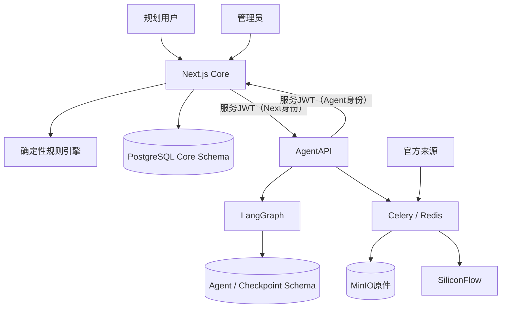
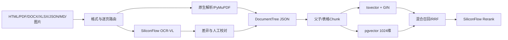

# PolicyOps Agent当前架构

> Author: Jan
> Status: Active
> Updated: 2026-09-05

## 上下文

PolicyOps在现有社保规划Core旁增加政策运营Agent。Next.js继续负责所有浏览器和用户业务；FastAPI、Celery和LangGraph只处理政策运营内部流程。

## Next.js Core

- 浏览器唯一入口和BFF。
- 统一登录注册（09-02）：`/login`、`/register`公开页面；user与admin共用入口；`/admin/login` 308重定向到统一登录。
- NextAuth v5 Credentials + 加密JWT Cookie保存15分钟授权声明（accessExpiresAt）与PostgreSQL刷新会话句柄；授权声明过期后由jwt callback经identity application验证并轮换刷新会话（行锁+HMAC确定性派生+30秒并发宽限，ADR-0007）。
- 客户端Session只暴露AuthenticatedActor：userId、username、role、authVersion、mustChangePassword。
- 用户、角色、状态、authVersion、刷新会话和安全审计事件保存于PostgreSQL（`users`、`auth_refresh_sessions`、`auth_audit_events`，migration 0008纯新增）。
- 规则、参数、测试、地区、快照、规划和发布归Core所有；新建规划/对话只绑定owner_user_id，session_id恒为NULL，历史匿名数据不在新入口展示。
- 服务端路由门禁（src/proxy.ts）执行固定双角色权限矩阵：匿名访问规划/对话/管理一律拒绝；管理敏感写操作经requireFreshAdmin重新查询数据库校验role、status和authVersion。
- Agent集成只暴露PolicyContext只读端口和受限DraftMaterialization端口。

依赖方向为`domain → application → infrastructure → route adapter`；Route Handler不得直接承载领域规则或越过Repository访问Drizzle。

## Agent Runtime

- FastAPI提供内部控制面和健康检查；文档与OpenAPI入口统一关闭（`docs_url`/`redoc_url`/`openapi_url`均为`None`，`/internal/docs`、`/docs`、`/redoc`、`/openapi.json`一律404，09-03复审缺漏一）。
- Celery和Redis负责采集、解析、OCR、Embedding、索引、重试和死信。
- LangGraph负责需要模型推理、Checkpoint和人工interrupt的状态流程。
- Worker并发和prefetch均为1，耗时任务不在FastAPI请求线程执行。
- Agent数据库角色只访问Agent和Checkpoint范围，不能直接写Core published表。

## 服务鉴权

- Docker内部网络是第一层隔离：Next与FastAPI仅通过内网互相调用；服务JWT是网络之外的第二层身份证明（ADR-0005）。
- Next与FastAPI双向通过短期服务JWT通信：HS256、TTL固定300秒、时钟偏差最多30秒（ADR-0005，09-03 Feature实现）。
- 固定身份：Next→Agent使用`iss=socila-next-core`、`aud=policy-agent`、`sub=next-core`；Agent→Core使用`iss=policy-agent`、`aud=socila-next-core`、`sub=agent-runtime`（09-05 SDL-FR-008自`ssp-next-core`一次性硬切换，Node/Python/CI冒烟/固定向量同提交原子切换，旧身份统一401不提供兼容）；claims另含UUID v4 `jti`、`iat`、`exp`（exp=iat+300，SJWT-FR-003～005）。
- 两端显式固定HS256（Node `jose`、Python `PyJWT>=2.10,<3`），拒绝`none`与任何算法降级；签发只使用current Secret，验证依次尝试current、previous；previous命中仅进入内部指标（SJWT-FR-002/007、NFR-001）。
- `AGENT_SERVICE_JWT_CURRENT`在web/agent/worker/beat四个消费者必填（≥32 UTF-8字节、previous与current相同或格式无效时启动失败，SJWT-AC-010）；`AGENT_SERVICE_JWT_PREVIOUS`可选，支持双窗口无中断轮换。
- Web Node运行时启动入口（`src/instrumentation.ts`，next dev/start与standalone server.js共用）启动期校验current Secret：缺失、不足32 UTF-8字节或与previous相同时以退出码1终止进程（Next 16 standalone中仅抛错不足以使进程退出，必须fail-fast），`/api/health`不构成绕过路径；instrumentation会被Next.js同时构建为Node与Edge运行时bundle，故启动校验与进程终止逻辑位于Node专用模块`src/lib/security/service-jwt-startup-node.ts`，`register`（async）仅在`NEXT_RUNTIME=nodejs`分支经动态import加载，Edge运行时不执行启动校验且构建零警告（2026-09-04运行时隔离复查）；Compose中`AGENT_SERVICE_JWT_CURRENT`为必填插值（`${…:?…}`），缺失或空值时`docker compose config`直接失败（09-03复审缺漏二）。
- FastAPI对除`/internal/health`（唯一免JWT内部端点）外的所有`/internal/*`业务端点验证Next身份令牌，`/internal/ready`必须携带合法JWT；Core仅在`/api/internal/v1/draft-imports`验证固定Agent身份（SJWT-FR-004/005、AC-015）。
- 鉴权失败（缺失、格式、签名、算法、claims、过期、超前、重放）统一返回401 `SERVICE_AUTH_INVALID`且不区分具体原因；重放存储不可用返回503 `SERVICE_AUTH_STORE_UNAVAILABLE`；两者均`Cache-Control: no-store`（SJWT-FR-009、AC-014）。
- `X-Service-Name`只作为不可信的结构化日志上下文，不参与允许/拒绝判断（SJWT-FR-006、AC-003）。
- 内部写请求（agent-run创建、proposal审核、draft物化）在接收方数据库事务内消费JTI：主键冲突视为重放统一401；业务回滚时JTI同回滚，调用方可用新JTI+相同业务幂等键安全重试（SJWT-FR-008、AC-011～013）。
- 重放表`public.service_jwt_replays`（Core，drizzle/0009）与`agent.service_jwt_replays`（Agent，migration 0007，`agent_app`最小读写）只保存JTI与claims元数据，不保存令牌或签名；过期行在消费时机会式清理（SJWT-NFR-006）。
- 浏览器和用户JWT不得获得内部服务Secret；JWT不含用户ID、用户名、角色或业务payload。
- 刷新会话HMAC pepper（`AUTH_REFRESH_PEPPER`）与`NEXTAUTH_SECRET`是两个独立密钥：compose必填插值拒绝缺失，identity容器启动时拒绝两者相同（09-03 PMG-FR-032）。

## 政策与规则模型

- DSL资产按"通用协议/地区资产"两层组织（09-05 SDL-FR-002）：通用Schema与发布工作流位于`dsl/protocol/socila_dsl_v1`，地区规则、参数、规则集、示例与Manifest位于`dsl/regions/<slug>_dsl_v1`（当前：`cn_dsl_v1`国家baseline、`guangdong_dsl_v1`广东、`sichuan_dsl_v1`四川、`shanghai_dsl_v1`上海）。
- 规则格式的唯一规范值为`SOCILA-DSL-1.0`（schema以`const`钉死）；`dsl_version`只表示JSON格式，不编码地区——地区由Manifest的`jurisdiction_code`表达（国家为`CN`，省级为行政区划代码），资产版本由`bundle_version`与实体版本独立递增（SDL-FR-001）。
- Seed经地区Manifest发现器（`src/lib/dsl/region-manifest.ts`）装载资产：校验Manifest与实际文件集合一致后把`jurisdiction_code`与路径交给装载器；装载代码不硬编码地区目录或行政区划（SDL-FR-004）。地区overlay允许仅提供参数（rules数组为空，如四川v1）。
- **显式overlay操作（09-05 NRP-FR-007）**：规则、参数、规则集均持久化`operation`（baseline/add/replace/restrict/exempt）与`target_business_key`列（drizzle/0012，CHECK约束强制：CN实体只能baseline、地区实体不能baseline、replace/restrict/exempt必带目标键、baseline/add不得带目标键）；合并器与快照服务不得按地区代码推断操作。replace/restrict/exempt必须解析到继承链上唯一上级业务键，add不得覆盖已存在键，冲突（missing-target/same-level-target/unknown-key/duplicate-add/same-level-overlap）阻止快照并落PolicyConflict。
- 国家baseline（NRP-FR-005）：全国统一的归一化/退休/养老/医保/失业框架规则与参数（渐进式延迟退休覆盖表、最低缴费年限时间线、失业金法定期限档、灵活就业基数区间）归属`CN`（规则集`RS-CN-PLAN-V1`、参数包`CN-BASELINE`）；地区执行标准以显式overlay落地（如上海失业金期限档表replace国家基线表、GD医保退休年限2030统一参数、GD医保退休restrict附加条件）。引擎与Seed按继承链装载参数（CN垫底、地区覆盖同名键）。
- 每个政策事实的evidence引用官方原件（document_id/artifact/content_sha256/locator/逐字excerpt）；`citation-contract.test.ts`验证摘录逐字存在于仓库内抓取原件，防伪造引用。政策含义无法从权威来源确定时不编码、转人工裁决（如四川医保退休年限待办）。
- 广东、四川示例包（`GD-EXAMPLE-BASE`、`SC-EXAMPLE-BASE`及四个示例参数）只是测试夹具（`src/server/modules/policy/__tests__/fixtures/regional-examples.ts`），生产Seed不写入（SDL-FR-012）。
- `Jurisdiction`保存国家、省、市、区县层级。
- 规则、参数、测试和政策携带business key、版本、地区、状态和有效期（params支持effective_to窗口装载）。
- 同级冲突和重叠有效期产生Conflict，不自动裁决。
- 发布快照保存解析后的地区继承链、版本集合、hash和provenance（provenance含operation与targetBusinessKey，NRP-AC-005）。
- JSON DSL继续保存在JSONB，并由AJV和JSON Schema校验（`dsl/protocol/socila_dsl_v1/schema/`）。
- **编辑字段白名单与测试隔离（09-05阶段E复审）**：管理端PATCH/PUT/POST经`src/lib/admin/entity-edit-policy.ts`白名单——受控字段（status/version/jurisdiction/businessKey/ID/policyPackId/时间戳等）与未知字段一律400，状态转换只能走publishing用例；blocked地区实体晋级被422拒绝。发布回归门禁按继承链地区加载测试（国家规则用CN测试，地方规则用目标地区+CN测试）。published完整性哈希为`to_jsonb`整行规范化哈希（UTC会话）。
- **受控物化（09-05阶段E）**：仓库权威资产进入持久库必须经`scripts/materialize-policy-regions.ts`（默认audit；apply需授权参数+manifest哈希+目标指纹三重校验；DATABASE_URL必须进程显式设置且仅限本机policyops，禁止dotenv回退）；四地区在单事务写入draft实体与批次审计（`policy_import_batches/members`），任一校验失败全部回滚；同manifest幂等no-op；CN/粤/川首次v1、上海既有键v2、新键v1；published行永不原地修改。恢复对账以`scripts/restore-reconcile.ts`目录驱动枚举4 schema全部BASE TABLE与sequence为准。参数携带结构化evidence（params.evidence）。地区就绪状态：CN/沪awaiting_approval、粤/川blocked（blocked实体由发布流水线强制拒绝晋级）。
- **draft包repair边界（WI-20260906-01，已实现并验收）**：audit输出`packSnapshotDrift`；目标指纹（`computeTargetFingerprint`）已绑定全部draft包行ID、地区、pack ID、版本、状态、`param_snapshot`规范化哈希及对应批次成员行ID/内容哈希——audit后任何draft变化都使指纹失配被拒。repair在单事务内对全部绑定目标`FOR UPDATE`锁定并重校验（状态/版本/旧哈希不符以`REPAIR_TARGET_CHANGED`零写入退出），原物化批次/成员不可改写；每目标追加确定性`repaired`批次（哈希由基础manifest哈希+地区+pack ID+版本+旧/新内容哈希生成，`computeRepairBatchHash`）和一条新成员，沿用地区readiness与blocking reasons（`isJurisdictionBlocked`纳入`repaired`状态），并发由0014唯一约束裁决、冲突后复核快照已完全一致则no-op。专用Red/Green证据见验收报告§14；持久库repair仍待用户另行授权，未执行。
- **管理端地区身份（NRP-FR-021）**：规则/参数/规则集列表支持jurisdiction_code筛选（规则另支持module与q检索编号名称）；详情/校验/示例执行/版本/晋级/回滚以jurisdiction_code+entity_id+version精确定位（缺失400、不存在404、不跨地区猜测）；发布审计记录地区与实体版本；`GET /api/admin/policy-coverage`输出各地区就绪状态与覆盖缺口。

## 文档、OCR与RAG

- HTML、DOCX、XLSX、JSON和Markdown优先原生解析。
- 文本PDF由PyMuPDF逐页提取，扫描或版面信息由PaddleOCR-VL-1.5处理。
- 原件保存到MinIO，DocumentTree是权威解析结构，Markdown是派生副本。
- 文号、日期、金额、比例冲突或缺少模型置信度时进入人工复核。
- 检索先过滤地区、有效期和发布状态，再执行全文、向量、RRF和重排。
- SiliconFlow Embedding为`BAAI/bge-m3`，实测维度1024；Rerank为`BAAI/bge-reranker-v2-m3`。

## 草案闭环

1. 比较完整新旧DocumentTree。
2. 检索受影响规则、参数、测试和历史案例。
3. 生成带引用、地区、有效期和provenance的DraftBundle。
4. 执行结构、引用、依赖和回归校验。
5. 管理员批准、编辑后批准或驳回。
6. 已批准Bundle通过服务JWT和幂等键调用Next Core。
7. Core二次校验后只创建draft；发布继续执行现有门禁。

## 数据所有权

| 数据 | 权威存储 | 所有者 |
| --- | --- | --- |
| 用户、会话、规划 | PostgreSQL Core | Next Core |
| 规则、参数、测试、地区、快照 | PostgreSQL Core | Next Core |
| Agent Run、提案、审核、事件 | PostgreSQL Agent | Agent Runtime |
| Graph Checkpoint | PostgreSQL Checkpoint | LangGraph |
| 原始政策和页面资源 | MinIO | Ingestion |
| Chunk、全文和向量 | PostgreSQL Agent | RAG |

## 部署

Personal Demo使用单机Docker Compose：Caddy、Next.js、FastAPI、Celery Worker、Beat、PostgreSQL 17 + pgvector、Redis和MinIO。只有反向代理对外；其他服务使用内部网络。Next生产构建在`next.config.ts`固定使用2个CPU worker，避免按开发机逻辑CPU数并行生成页面时超出本机或4GB Demo资源口径；该设置不改变运行时并发。详细资源和恢复规则见[OPERATIONS](./OPERATIONS.md)。

### 运行配置与凭据（09-03 CFG）

- 配置所有权：宿主脚本与本地开发经共享加载器 `scripts/lib/load-environment.mjs` 取 `.env.local`（优先）→ `.env`（回退），进程环境永远优先、不被文件覆盖；Compose 运行时使用 `infra/prod/.env`。根 `.env` 已删除，宿主不再以远程数据库为目标。
- `NEXTAUTH_SECRET` 与 `AUTH_REFRESH_PEPPER` 在宿主与 Compose 两个运行时取值一致；`POSTGRES_PASSWORD`/`DATABASE_URL`/`AGENT_DATABASE_URL` 只在 `infra/prod/.env` 维护，宿主 `DATABASE_URL` 只使用 `localhost:5432` 映射。
- 管理员引导一次性完成：`scripts/bootstrap-admin.mjs` 只从显式进程变量读取 `ADMIN_USERNAME`/`ADMIN_PASSWORD_HASH`（bcrypt cost 12）；运行时登录只查 `users` 表，任何活动配置、模板与 Compose 环境都不再常驻 `ADMIN_*` 变量。
- 远程数据库门禁：宿主脚本默认只允许 localhost/127.0.0.1/::1；Compose 内仅 `migrate` 服务持有 `ALLOW_REMOTE_DATABASE=1` 例外（其内部DNS `postgres` 会被宿主门禁视为远程），其余服务零例外（最小权限）。
- 服务JWT：`AGENT_SERVICE_JWT_CURRENT`在web/agent/worker/beat四个消费者必填（≥32 UTF-8字节，worker/beat经tasks模块导入期校验，Web经Node运行时启动入口`src/instrumentation.ts`fail-fast校验，Compose以`:?`必填插值使缺失/空值在`docker compose config`阶段失败，SJWT-AC-010）；`AGENT_SERVICE_JWT_PREVIOUS`可选，支持双窗口轮换；签发只用current，验证依次current→previous（09-03 SJWT-FR-001/007，实现见“服务鉴权”节）。宿主机侧两个变量由`.env.example`模板声明，实际值仅保存在Git忽略的`.env.local`（安全同步，不轮换）。
- 凭据轮换：PostgreSQL口令轮换前必须先完成新鲜 `pg_dump -Fc` + SHA-256清单 + PG17+pgvector真实恢复对账；轮换后必须完成逐表行数对账、迁移幂等与健康检查。runbook见[OPERATIONS](./OPERATIONS.md)。

### 质量门禁（09-03）

GitHub Actions六job工作流（`.github/workflows/ci.yml`），触发`pull_request`、`main` push与`workflow_dispatch`；同ref并发取消；job级timeout；默认token仅`contents: read`；第三方Action全部固定提交SHA。

| Job | 内容 |
| --- | --- |
| `gates` | tsc、ESLint、Node单元测试（零数据库依赖、零skip） |
| `agent-gates` | ruff、mypy、Python单元（`-m "not integration"`）、pip-audit |
| `database-gates` | 全新pgvector PG17：Core migration/引导各两次（幂等）、seed、`npm run test:db`、Agent migration+角色授权、Python集成 |
| `e2e-gates` | 全新库+standalone构建+mock模型：`npm run test:e2e:auth`（10项Auth流程含助手回复） |
| `container-gates` | 构建web/agent最终镜像；合成env+临时卷Compose冒烟（健康检查后执行SJWT-AC-017双向冒烟：合法双向调用通过、伪造服务名拒绝，随后无条件`down -v`）；Trivy 0.74.0扫描（HIGH/CRITICAL，ignore-unfixed，`scanners: vuln`） |
| `security-gates` | `scan-secrets.mjs --all` + Gitleaks 8.29.1完整历史（`fetch-depth: 0`，`.gitleaksignore`仅7个已核实fingerprint）+ allowlist哨兵回归`verify-gitleaks-allowlist.mjs`（09-05复审纠正ADR-0009：`.gitleaks.toml`采用`[[allowlists]]`+`targetRules`+`condition="AND"`按"规则×路径"精确忽略——禁止旧式全局allowlist的按路径整文件跳过；哨兵断言允许路径上其他规则照常检测） |

运行镜像加固：web基于node:22-alpine，`apk upgrade`后删除npm/npx/corepack完整目录（`/usr/local/lib/node_modules`与`/usr/bin`），非root `node`用户；agent基于python:3.11-slim，运行层`apt-get upgrade`后删除全局pip/setuptools/wheel，uv仅存在于build stage，非root `appuser`。占位配置不使用Docker ARG/ENV保存Secret名称，仅在执行build的单层命令中使用非真实占位值。

## 已接受决策

- 保留Next.js Core，不引入NestJS。
- Docker内网隔离+HS256短期服务JWT双向鉴权，JTI重放消费与业务写同事务（ADR-0005，09-03 Feature已实现验收）。
- NextAuth 15分钟授权声明 + PostgreSQL刷新会话双层会话（ADR-0007）；固定双角色权限矩阵，不建立通用RBAC。
- 决策记录见[decisions](./decisions/)目录（ADR-0007起）。
- Python内部控制面使用FastAPI。
- LangGraph用于可恢复、需要人工中断的政策运营流程。
- PostgreSQL JSONB兼容现有JSON规则，pgvector与业务元数据同库。
- Personal Demo不在本地加载Docling完整流水线或OCR/VLM模型。
- 外部模型只接收公开政策和去标识化规则元数据。

历史ADR见[archive/decisions](./archive/README.md)。
