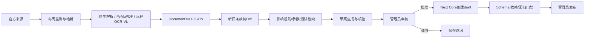
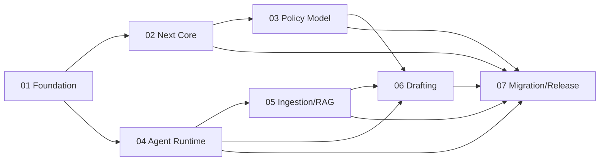

# 全国政策运营 Agent 平台 PRD

## 文档元数据

| 字段 | 值 |
| --- | --- |
| 产品 | PolicyOps Agent / 社保政策运营平台 |
| 状态 | Approved for implementation planning |
| 当前分支 | `refactor/policy-ops-agent-platform` |
| 首期地区 | 国家、上海、广东、四川 |
| 目标用户 | 政策管理员、系统管理员、社保规划用户 |
| 交付模式 | 7个阶段、Goal模式全自动执行、阶段验收后提交并推送 |
| 生产形态 | 单台企业内网Linux服务器、Docker Compose |

## 1. 产品背景

现有系统能够通过JSONLogic DSL和参数包计算上海社保规划，但政策来源发现、版本比较、影响分析、规则编写与测试生成仍高度依赖人工。全国扩展后，国家、省、市、区县之间存在继承、覆盖、豁免和有效期交叉，仅靠增加城市条件会形成不可维护的巨型规则集。

本产品将政策运营过程建设为可审计的Agent工作流：系统监测官方来源，保存原始文件，构造结构化政策条款树，比较政策版本，检索受影响规则、参数和测试，生成带原文引用的草案，并在管理员确认后将草案写入现有发布体系。任何政策数值结论仍由确定性规则引擎产生。

## 2. 产品原则

1. **确定性优先**：LLM不能替代规则引擎计算政策数字。
2. **证据优先**：每个政策事实、差异和草案字段必须引用原始政策位置。
3. **人工负责**：Agent只能生成draft，管理员负责审核，发布继续走确定性门禁。
4. **版本不可变**：published规则、参数和政策快照不能原地更新。
5. **地区可解释**：每次计算可解释国家基线和地方overlay的合并结果。
6. **原件保留**：Markdown是派生产物，不能替代原始文件和DocumentTree JSON。
7. **最小权限**：Agent、用户和管理员使用不同权限边界。

## 3. 用户与问题

### 3.1 政策管理员

需要及时发现官方政策变化、判断地区和生效范围、了解影响的规则与案例，并以可审查方式生成DSL、参数和测试草案。

### 3.2 系统管理员

需要管理来源、任务、密钥、队列、存储、备份、恢复和服务健康，同时确保Agent不能绕过发布权限。

### 3.3 规划用户

需要获得基于目标地区、指定日期和明确政策快照的可复算规划；用户无需感知政策采集和Agent内部过程。

## 4. 总体用户流程

## 5. 功能需求

### 5.1 来源与文档

- **PRD-FR-001** 管理员能够登记官方域名、入口URL、地区、发布机关、内容类型和监测频率。
- **PRD-FR-002** 系统每周抓取来源，通过规范化内容哈希识别新增、修改和未变化内容。
- **PRD-FR-003** 系统保存原始响应、附件、抓取时间、HTTP元数据和最终URL。
- **PRD-FR-004** 支持HTML、PDF、扫描PDF、DOC/DOCX、XLS/XLSX、Markdown、TXT、图片和JSON。
- **PRD-FR-005** 解析结果必须包含DocumentTree、派生Markdown、页面资源和解析质量信息。
- **PRD-FR-006** OCR低置信度页面进入人工校对，校对完成前不得成为可发布引用。

### 5.2 全国政策模型

- **PRD-FR-010** 系统维护国家、省、市、区县父子层级。
- **PRD-FR-011** 国家政策形成基线，地方政策以新增、替换、限制或豁免overlay表达。
- **PRD-FR-012** 规则、参数、测试和政策版本携带地区范围及有效期。
- **PRD-FR-013** 同级冲突或有效期重叠生成管理员任务，不自动裁决。
- **PRD-FR-014** 每次规划保存解析后的地区继承链和发布快照ID。

### 5.3 RAG

- **PRD-FR-020** 文档按章、节、条、款、项、附件和表格构造父子Chunk。
- **PRD-FR-021** 检索先应用地区继承链、生效日期和发布状态过滤。
- **PRD-FR-022** 系统合并精确、全文和pgvector召回，并通过SiliconFlow Rerank重排。
- **PRD-FR-023** 返回上下文必须包含父条款和可定位引用。
- **PRD-FR-024** Embedding模型、维度、分片版本和索引版本必须可追踪。

### 5.4 Agent与草案

- **PRD-FR-030** LangGraph保存节点Checkpoint，支持进程重启和人工等待后恢复。
- **PRD-FR-031** Agent比较完整DocumentTree，而不是依赖RAG推断政策Diff。
- **PRD-FR-032** Agent检索受影响规则、参数、测试和历史案例。
- **PRD-FR-033** Agent生成影响报告、JSON DSL、参数和测试草案。
- **PRD-FR-034** 每个草案字段必须绑定原文引用、地区和有效期。
- **PRD-FR-035** 管理员可批准、编辑后批准或驳回。
- **PRD-FR-036** 批准后只能通过Next Core受限接口创建draft。

### 5.5 发布与审计

- **PRD-FR-040** Core在导入时重新执行Zod、AJV、权限、状态和幂等校验。
- **PRD-FR-041** staging和production仍通过现有确定性发布门禁。
- **PRD-FR-042** 来源、解析、模型、Prompt、检索、草案、审核和发布形成完整审计链。
- **PRD-FR-043** published实体不可原地修改，回滚通过切换快照完成。

## 6. 非功能需求

- **PRD-NFR-001 安全**：政策文本作为不可信数据，不得改变工具权限或系统指令。
- **PRD-NFR-002 隐私**：用户身份、对话、画像和规划结果不得发送到政策Embedding、Rerank或Agent模型。
- **PRD-NFR-003 可恢复**：PostgreSQL、MinIO和LangGraph Checkpoint必须能从离机备份恢复。
- **PRD-NFR-004 幂等**：重复任务、恢复或审核提交不得创建重复文档、向量或draft。
- **PRD-NFR-005 可观测**：请求、任务和Run使用关联ID，并记录耗时、Token、模型、失败和管理员决定。
- **PRD-NFR-006 可测试**：所有外部模型调用必须可替换为确定性测试桩。
- **PRD-NFR-007 兼容**：现有112个测试和规划黄金结果在迁移后保持一致。

## 7. 系统边界

- Next.js是唯一浏览器入口和业务Core。
- FastAPI只提供内部Agent控制面。
- Celery负责周期任务、队列、重试和死信。
- LangGraph负责需要模型推理、Checkpoint和人工interrupt的流程。
- 本地PostgreSQL保存Core、Agent和Checkpoint Schema；不同角色隔离权限。
- MinIO保存原始政策和页面资源。
- SiliconFlow仅处理公开政策和去标识化规则元数据。

## 8. 数据与接口边界

- `PolicyContext`：Agent只读的已发布地区、政策快照、规则、参数和测试上下文。
- `DraftBundle`：基准快照、地区、有效期、规则草案、参数草案、测试草案、引用、差异和provenance。
- `ReviewDecision`：批准、编辑后批准或驳回，以及管理员、时间、原因和幂等键。
- `AgentRunStatus`：queued、running、waiting_review、approved、rejected、failed、completed。
- 所有跨服务契约通过版本化OpenAPI定义，浏览器不直接访问FastAPI。

## 9. 阶段与依赖

## 10. 成功指标

- 历史政策评测集中受影响规则召回率不低于90%。
- 草案展示前JSON Schema通过率为100%。
- 草案事实引用覆盖率为100%。
- 错误地区或失效政策混入最终上下文的比例为0。
- Agent和FastAPI创建staging或production数据的路径为0。
- 至少两次Neon迁移演练结果一致。
- PostgreSQL、MinIO和Checkpoint完成空服务器恢复演练。

## 11. 非目标

- 首期覆盖全国全部地区或全部政府站点。
- 多管理员四眼审批、企业SSO和多租户。
- Agent自动发布或修改生产规则。
- Kubernetes、独立向量数据库或多Agent自治系统。
- 将用户规划Agent重写为LangGraph。

## 12. 风险与缓解

| 风险 | 缓解 |
| --- | --- |
| 官方站点结构和反爬变化 | 来源适配器、哈希、失败告警和人工上传兜底 |
| OCR或表格解析错误 | 置信度门禁、原图对照和人工校对 |
| 模型生成无依据草案 | 强制引用、结构校验、历史回放和管理员审核 |
| 地区政策冲突 | 显式冲突任务，禁止自动发布 |
| 单机故障 | 每日离机备份、公开Demo前恢复验证并记录实际耗时 |
| 外部API下线或变更 | ModelGateway、模型列表验证和索引版本化 |

## 13. 总体Definition of Done

- 七个阶段PRD全部验收通过并有证据报告。
- 全部实现步骤可追踪到需求ID和测试。
- 现有测试、黄金规划、RAG评测和安全测试通过。
- 单机生产环境完成部署、备份、恢复和回退演练。
- 首期四个地区的真实政策流程从采集到draft闭环运行。
- memory-bank反映最终真实架构、技术栈、进度和提交。
- 未提交任何密钥、local配置、生产数据或备份。
