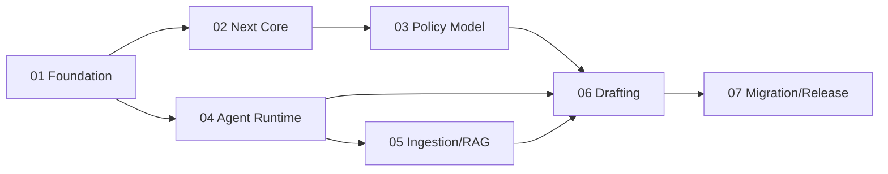

# PolicyOps Agent七阶段重构计划

> Author: Jan
> Status: Accepted
> Updated: 2026-09-01

## 目标

将原有单城市社保规则工具重构为全国政策运营Agent平台，同时保持确定性规则结果、发布门禁和用户数据边界不退化。

本文件只保留已经执行的计划摘要。详细阶段合同已归档，实际结果以阶段验收报告和Git提交为准。

## 阶段结果

| 阶段 | 目标 | 结果 | 历史PRD | 验收报告 |
| --- | --- | --- | --- | --- |
| 01 Foundation | 固化版本、黄金结果、migration、契约、Secret和CI门禁 | PASS | [PRD](./archive/stage-prds/01-foundation-prd.md) | [报告](./reports/stage-01/acceptance-report.md) |
| 02 Next Core | 领域模块化、Repository、事务、权限和本地PostgreSQL | PASS | [PRD](./archive/stage-prds/02-next-core-prd.md) | [报告](./reports/stage-02/acceptance-report.md) |
| 03 Policy Model | 地区树、国家基线、地方overlay、冲突和不可变快照 | PASS | [PRD](./archive/stage-prds/03-policy-model-prd.md) | [报告](./reports/stage-03/acceptance-report.md) |
| 04 Agent Runtime | FastAPI、Celery、LangGraph、Checkpoint、审核和服务JWT | PASS | [PRD](./archive/stage-prds/04-agent-runtime-prd.md) | [报告](./reports/stage-04/acceptance-report.md) |
| 05 Ingestion/RAG | 白名单采集、解析、OCR、DocumentTree、分片和混合检索 | PASS | [PRD](./archive/stage-prds/05-ingestion-rag-prd.md) | [报告](./reports/stage-05/acceptance-report.md) |
| 06 Drafting | 条款Diff、影响分析、DraftBundle、审核和Core物化 | PASS | [PRD](./archive/stage-prds/06-policy-drafting-prd.md) | [报告](./reports/stage-06/acceptance-report.md) |
| 07 Migration/Release | 单机部署、Neon迁移、恢复、回退和正式切换 | PASS | [PRD](./archive/stage-prds/07-migration-release-prd.md) | [报告](./reports/stage-07/acceptance-report.md) |

## 依赖顺序

执行时采用单分支串行模型，每阶段通过Definition of Done和独立证据检查后再进入下一阶段。

## 关键交付

- Next.js Core完成领域、application和infrastructure分层。
- 运行时从Neon专用驱动迁移到标准PostgreSQL连接池和版本化migration。
- 全国政策模型支持地区继承、overlay、冲突和不可变发布快照。
- Python Agent具备FastAPI控制面、Celery任务、LangGraph恢复和人工审核。
- 文档处理支持原生格式、PyMuPDF和SiliconFlow PaddleOCR-VL-1.5。
- RAG使用PostgreSQL全文、pgvector、RRF和SiliconFlow Rerank。
- Agent草案只能在批准后通过Next Core创建draft。
- Personal Demo完成Docker Compose、数据迁移、备份、恢复和回退演练。

## 关键提交

| 交付 | 提交 |
| --- | --- |
| Foundation | `0f63530` |
| Next Core | `27a0a68` |
| Policy Model | `fc43368` |
| Agent Runtime | `95ea7ff` |
| Ingestion/RAG | `d20ca01` |
| Drafting | `1ec7f09` |
| Migration/Release | `94d08fe`、`b9a6f1b` |

## 完成结论

- 七份阶段验收报告均为PASS。
- Neon数据完成多轮演练、正式迁移和对账；运行时事实源切换至本地PostgreSQL。
- PostgreSQL、MinIO和Agent数据具备备份与恢复证据。
- 规划黄金结果、权限、幂等、引用和安全边界均有自动化或演练证据。
- 当前遗留方向不影响七阶段完成，统一进入[ROADMAP](./ROADMAP.md)。
