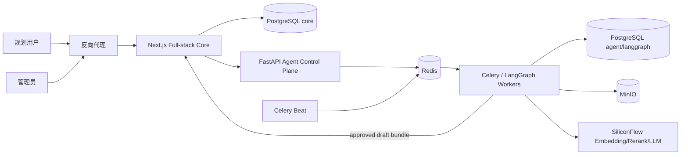
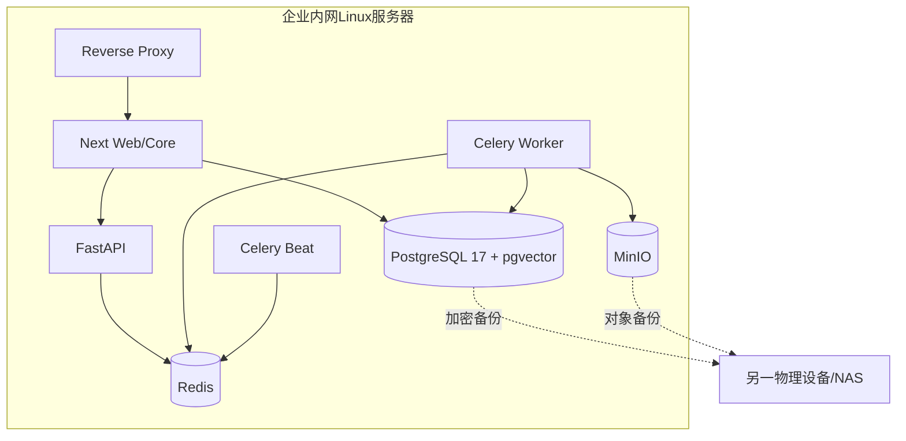
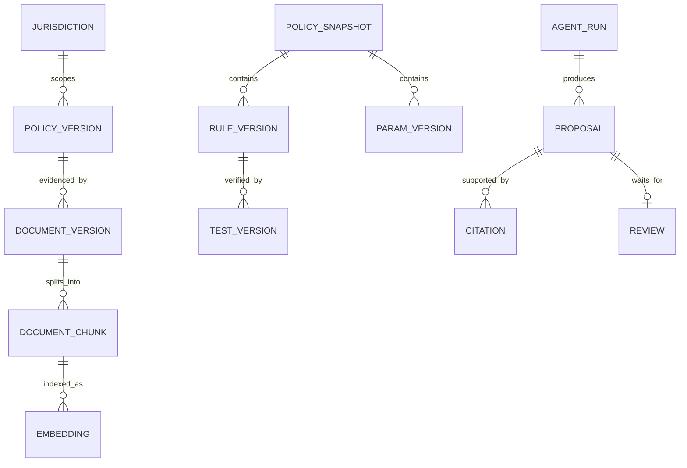
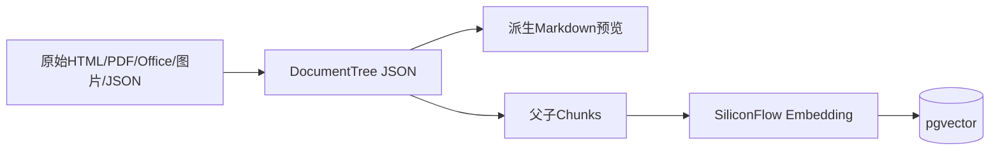
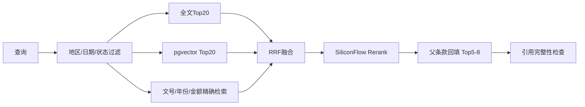
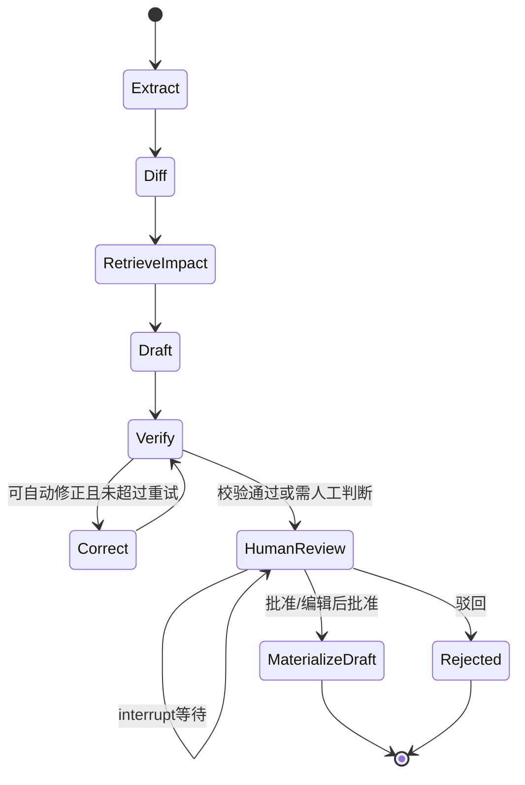
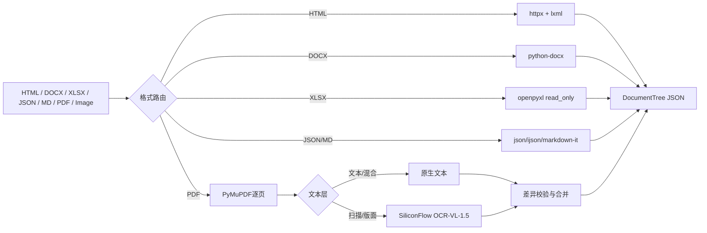

# PolicyOps Agent 目标架构

> 用途：维护系统当前目标结构、模块职责、数据所有权、调用方向和部署边界。写实现代码前必须阅读；实现改变架构事实后同步更新，不记录任务流水账。

## 系统上下文



浏览器只访问反向代理和Next。FastAPI、PostgreSQL、Redis和MinIO仅在内部容器网络中可达。

## 单机部署



单机部署降低运维成本，但不提供节点级高可用。容器重启可恢复服务，主机级故障依赖离机备份恢复。

## Next Core边界

阶段02落地：九模块位于 `src/server/modules/<module>/{domain,application,infrastructure,contracts}`，数据库运行时为 `src/lib/db/index.ts` 的本地 PostgreSQL `pg.Pool`（惰性初始化）；集中式 `queries.ts` 已删除，数据访问只经模块仓储。

- `identity`：用户、Session、角色和资源所有权。
- `jurisdiction`：国家、省、市、区县层级和继承链。
- `policy`：政策包、版本、来源引用和发布快照。
- `rules`：JSON DSL、参数、规则集、测试和纯规则引擎。
- `planning`：规划计算、场景和方案持久化。
- `conversation`：聊天、用户画像和AI SDK流。
- `publishing`：draft、staging、production和回滚门禁。
- `audit`：用户与政策操作审计。
- `agent-integration`：只读上下文和draft bundle导入。

Route Handler不包含领域规则，领域模块不导入 `next/server`。

## 跨服务API契约约定（阶段01固定，FND-FR-004～007）

- 契约源：`src/lib/api/contracts.ts`（Zod运行时校验源，框架无关）。Next公开与管理接口的错误体、请求上下文、幂等元数据从该模块派生；FastAPI侧在阶段04按同一约定实现，两端契约差异视为缺陷。
- 统一错误体 `ApiError { code, message, requestId, details? }`；稳定业务码→HTTP状态固定映射，覆盖400/401/403/404/409/413/422/429/500/503。存量路由的 `{ error }` 旧形态在阶段02模块化时逐域替换，不一次性改写。
- `RequestContext { requestId, actorId?, role?, sessionId?, source }`：requestId取 `X-Request-Id` 头（缺省生成UUID）并回写响应头；role ∈ user/admin/agent；source ∈ web/service/agent。身份由auth层传入，不接受客户端伪造。
- 幂等：写接口以 `Idempotency-Key` 头声明幂等键；相同键重复提交要么返回首次结果，要么以 409 CONFLICT 拒绝（FND-AC-005），禁止部分执行或重复副作用。事务边界在application用例层（阶段02.6落地）。
- 版本与兼容：公开API破坏性变更必须引入新版本前缀（如 `/api/v2/...`）并保留旧版本过渡期；内部服务接口固定 `/api/internal/v1/...` 前缀 + `X-Service-Name` 服务身份头，不接受浏览器Cookie作为唯一认证。
- OpenAPI：Zod为运行时校验源，OpenAPI文档由Zod Schema派生生成（阶段04建立生成流程）；本阶段只固定约定，不迁移全部接口。

## Agent Runtime（阶段04落地）

Python 服务位于 `services/agent/`：FastAPI 控制面（/internal/v1，仅内部）+ Celery/Redis 队列（graph/schedule/dead）+ LangGraph PolicyOpsGraph（PostgresSaver Checkpoint）。Agent 数据位于 agent schema（runs/artifacts/proposals/reviews/events），专用角色 agent_app 对 core schema 零权限；对 Core 写入仅经 materialize 幂等端口（draft 导入）。

## 数据所有权



- `core`：用户、地区、正式政策、规则、参数、测试、发布和规划。
- `agent`：来源、原始文档元数据、DocumentTree、Chunk、Embedding、Run、Proposal和Review。
- `langgraph`：Checkpoint和线程状态。
- MinIO：原始文件、页面图、OCR结果和解析资源。

不同Schema使用不同数据库角色；Agent角色不拥有Core表权限。

## PostgreSQL JSON模型

规则使用关系字段与JSONB组合：

```text
rule_versions
  id
  rule_id
  jurisdiction_id
  version
  status
  effective_from / effective_to
  definition jsonb
  source_document_version_id
  content_hash
```

PostgreSQL保证JSON语法，AJV保证DSL Schema。published版本不可更新，只能创建新版本。

## 文档三层模型



- 原始文件是审计来源。
- DocumentTree是权威解析结构。
- Markdown是人类与模型可读副本，不是唯一输入。
- Chunk保留文号、地区、有效期、条款路径、页码、坐标和父节点。

## RAG数据流



新旧政策变化使用DocumentTree完整Diff，RAG只用于搜索既有政策、规则、参数和测试。

## PolicyOpsGraph



所有副作用节点必须幂等。恢复节点不得重复下载、重复收费或重复创建draft。

## SiliconFlow边界

- Base URL和路径来自被忽略的本地配置。
- 密钥不进入数据库、日志、Prompt或Git。
- 只发送公开政策和去标识化规则元数据。
- 401/403不重试；429/503和网络超时有限退避重试。
- 记录trace ID、模型、Token和延迟，不记录完整向量。
- 模型或维度变化创建新的Embedding索引版本。

## 身份与服务鉴权

- NextAuth使用JWT Session；用户和role存PostgreSQL，JWT携带userId、role、authVersion。
- 敏感写操作校验数据库active状态和authVersion，角色或密码变化后递增版本。
- Next签发5分钟HS256服务JWT给FastAPI，校验issuer、audience、subject、jti、iat和exp。
- 允许30秒时钟偏差；审核与draft物化的jti写入Redis短期集合防止重放。
- current/previous两个Secret支持轮换；Secret不进入Git、日志或浏览器。
- 多机部署时再评估mTLS，当前单机以Docker内部网络为第一层隔离。

## 格式解析与OCR数据流



- Demo服务器不常驻Docling或本地OCR/VLM；Docling仅开发机离线辅助。
- Parser/Celery concurrency=1、prefetch=1、内存上限768MB。
- 原始文件是审计源，DocumentTree是权威解析结构，Markdown仅派生预览。

## Personal Demo资源边界

- 4核4GB、总用户≤100、并发≤5，无正式性能SLA。
- Next 512MB、FastAPI 384MB、Worker 768MB、PostgreSQL 768MB、Redis 128MB、MinIO 256MB、反向代理64MB，约1GB留给系统。
- 内存>90%、磁盘>80%、连接池>80%或队列>50时暂停后台任务。
- 每日pg_dump与MinIO离机同步，保留14天；公开Demo前执行一次恢复验证。

## 安全控制

- 抓取域名和路径白名单，解析DNS后阻止内网地址。
- 限制重定向、文件大小、页数、解压量、解析时间和MIME。
- 文档正文作为不可信数据，不能影响系统指令和工具授权。
- Agent没有任意SQL、Shell或开放URL工具。
- Core导入端重新执行Zod、AJV、权限和状态校验。
- 所有审核与发布保留不可删除审计记录。

## 可观测性

- 所有请求、任务和Agent Run使用关联ID。
- 记录采集成功率、解析失败、OCR低置信度、队列延迟和死信。
- 记录检索候选、过滤条件、模型版本、Token、引用和管理员决策。
- 不记录密钥、Authorization Header、完整向量或个人资料。

## 迁移与回退

1. 在演练环境从migration建立空本地数据库。
2. 从Neon导出并导入，校验记录数、哈希、序列、UUID、日期和JSONB。
3. 运行全部测试、黄金规划和历史政策回放。
4. 至少完成两次演练后进入维护窗口。
5. 正式切换后保留Neon只读回退窗口。
6. 主机故障通过离机PostgreSQL、MinIO和Checkpoint备份恢复。

## 架构决策摘要

- 保留Next.js Core，不引入NestJS。
- Python Agent独立为FastAPI + Celery + LangGraph。
- 本地PostgreSQL代替Neon，JSON DSL继续使用JSONB。
- 使用pgvector而非独立向量数据库。
- 使用SiliconFlow托管Embedding和Rerank，真实模型待安全验证。
- 采用国家基线加地区overlay。
- Agent只能创建draft。
