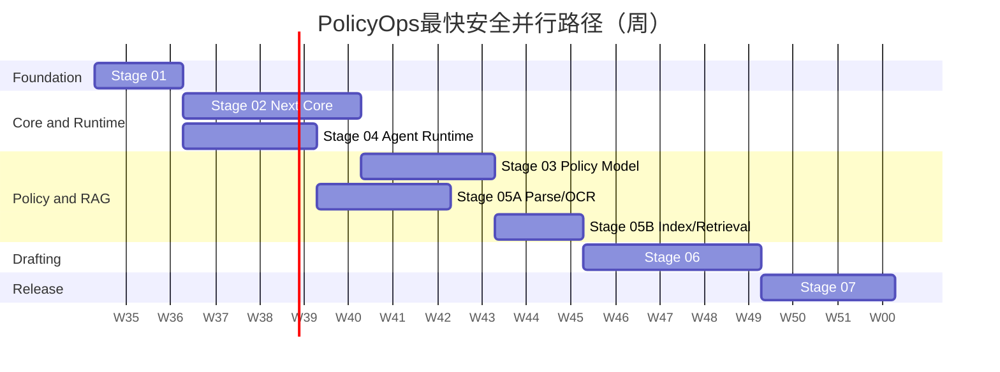

# 最快并行开发计划

## 目标与约束

目标是在4～6名工程人员、七个Goal对话和独立工作树条件下，缩短关键路径，同时避免共享Schema、OpenAPI和memory-bank的并发冲突。

约束：

- 所有阶段分支从已验收的集成检查点创建。
- 七个对话可以同时建立和阅读上下文，但只有依赖满足的阶段允许写代码。
- 集成Agent唯一修改共享memory-bank、跨服务OpenAPI和根架构决策。
- 每阶段验收通过后提交并推送；不自动创建PR或合并main。
- 生产操作、密钥和不可逆动作仍需用户授权。

## 角色与并行槽位

推荐6人配置：

| 槽位 | 角色 | 主要职责 |
| --- | --- | --- |
| A | 集成/架构Agent | 契约冻结、共享文件、合并、最终门禁 |
| B | Next Core Agent 1 | 领域、Repository、用例 |
| C | Next Core/Policy Agent 2 | 权限、政策模型、后台 |
| D | Python Agent Agent 1 | FastAPI、Celery、LangGraph |
| E | RAG Agent 2 | 解析、OCR、索引、检索 |
| F | QA/DevOps Agent | 独立测试、安全、迁移和恢复 |

4人配置合并B/C和D/E；5人配置保持独立RAG，QA由集成Agent协助。

## 分支与工作树

| 阶段 | 分支 | 基点 | 负责提示词 |
| --- | --- | --- | --- |
| 01 | `stage/01-foundation` | 当前重构分支 | 全流程/数据库/QA |
| 02 | `stage/02-next-core` | Stage01集成提交 | Next Core |
| 03 | `stage/03-policy-model` | Stage02接口冻结提交 | Next Core/数据库 |
| 04 | `stage/04-agent-runtime` | Stage01集成提交 | FastAPI/LangGraph |
| 05 | `stage/05-ingestion-rag` | Stage04提交 + Stage03元数据契约 | RAG |
| 06 | `stage/06-policy-drafting` | Stage03/04/05集成提交 | FastAPI/LangGraph + Next |
| 07 | `stage/07-migration-release` | Stage02～06集成提交 | 数据库/DevOps/QA |

每个工作树只修改该阶段授权范围；共享文件变更通过集成Agent合入。

## 关键路径与波次

计划以相对周为准，图中日期只用于表达顺序。积极目标18周，另保留2周风险缓冲；不通过压缩验收或跳过恢复演练缩短工期。

### 波次0：文档与集成准备

- 集成Agent确认PRD、OpenAPI规范、分支和工作树规则。
- 七个阶段对话可以创建，但阶段02～07只读，不写实现。

### 波次1：Foundation

- Stage01单独获取共享Schema、CI和migration基线写权限。
- QA并行准备基线验收，但不修改实现。
- Gate G1：Stage01验收、提交、推送并合入重构分支。

### 波次2：Next Core与Agent Runtime

- Stage02和Stage04从同一G1基点并行。
- Stage02拥有Core Schema和TypeScript共享契约写权限。
- Stage04拥有Python Agent Schema、FastAPI OpenAPI草案和Agent运行时。
- 集成Agent维护跨服务契约，不允许两个阶段直接修改同一OpenAPI文件。
- Gate G2：Next Core端口冻结；Gate G4：Agent Runtime Fake闭环通过。

### 波次3：Policy Model与Ingestion/RAG

- Stage03从G2开始，独占Core政策Schema租约。
- Stage05A在G4后开始来源、Docling、OCR、MinIO和DocumentTree，不等待Stage03全部完成。
- Stage03先交付Jurisdiction、有效期和PolicyContext元数据契约；集成Agent冻结后，Stage05B开始索引和过滤。
- Gate G3：国家基线/overlay/快照通过；Gate G5：RAG和引用评测通过。

### 波次4：Policy Drafting

- Stage06从G3+G4+G5集成提交创建工作树。
- Next与Python实现可在Stage06工作树内分两个工作包并行，但DraftBundle由集成Agent唯一冻结。
- Gate G6：真实政策从采集到Core draft闭环通过。

### 波次5：Migration/Release

- Stage07在全部功能Gate后开始。
- DevOps准备Compose/监控，数据库Agent准备迁移/备份，QA准备容量/安全，可三线并行。
- 正式切换需用户显式授权；未授权时只完成ready-to-release。
- Gate G7：两次迁移、空机恢复、回退和最终独立审查通过。

## 共享文件所有权

| 资源 | 唯一所有者 | 阶段Agent操作方式 |
| --- | --- | --- |
| memory-bank与总体PRD | 集成Agent | 在验收报告中提出更新，集成Agent落盘 |
| Core Drizzle Schema/migrations | 当前持有Schema租约的阶段 | 其他阶段提交Schema change request |
| FastAPI OpenAPI | Stage04/06，经集成Agent冻结 | Next使用生成客户端，不手改镜像类型 |
| DraftBundle/PolicyContext | 集成Agent | 两端对契约实现，变更需ADR |
| 根依赖和Compose | 集成Agent/Stage07 | 阶段分支不得并发修改 |
| SiliconFlow local env | 用户/本地环境 | Agent只读取，不提交、不输出 |

Schema租约记录在progress；未持有租约的Agent不得修改共享Schema。

## 集成与合并顺序

1. 阶段Agent完成验收报告和阶段提交，推送阶段分支。
2. 独立QA Agent重跑阶段门禁并审阅diff。
3. 集成Agent确认需求追踪、契约兼容和共享文件更新。
4. 按Stage01；Stage02/04；Stage03/05；Stage06；Stage07顺序合入重构分支。
5. 每次集成后重跑受影响阶段和全局基线，再创建下一阶段工作树。

禁止在未集成上游提交的情况下让下游分支自行复制接口或Schema。

## 阶段验证命令族

- 全局：依赖安装、源码Lint、类型检查、112测试、生产构建、敏感扫描、Markdown/链接检查。
- Stage01：空库migration、契约快照和Secret ignore。
- Stage02：Repository、事务、权限、API兼容和引擎确定性。
- Stage03：地区继承、overlay属性、冲突、快照和上海黄金回归。
- Stage04：API、队列、Checkpoint、interrupt、幂等和数据库权限。
- Stage05：格式/OCR、安全、分片、SiliconFlow、检索和RAG评测。
- Stage06：Diff、影响、Schema、引用、审核、权限和端到端闭环。
- Stage07：部署、两次迁移、容量、安全、离机备份、空机恢复和回退。

## 冲突与重新排程

- 共享文件冲突：阶段Agent停止修改，由集成Agent选择权威版本并更新ADR。
- 上游契约变化：冻结受影响下游步骤，更新PRD/计划后从最新集成提交重放。
- 阶段延迟但接口稳定：允许依赖该接口的测试桩工作继续；禁止假装真实集成完成。
- SiliconFlow受阻：Stage05先完成Fake和本地检索，真实API与最终向量Schema保持阻塞。
- 生产授权受阻：Stage07完成ready-to-release，不阻塞前六阶段完成。

## 最快计划完成条件

- 每个工作包有唯一分支、文件范围、提示词和验收。
- 关键路径上无等待可提前交付的接口或测试桩。
- 共享Schema/OpenAPI/memory-bank无并发写入。
- 每个Gate有独立QA和新鲜证据。
- 工期优化不删除安全、迁移、恢复或政策人工决策门禁。
